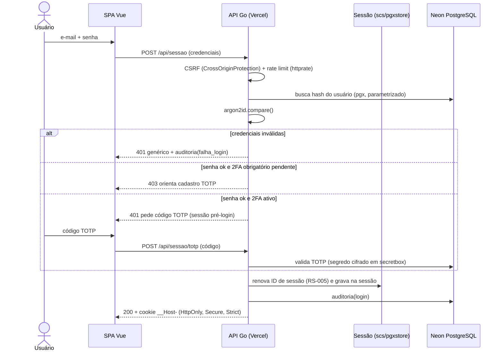
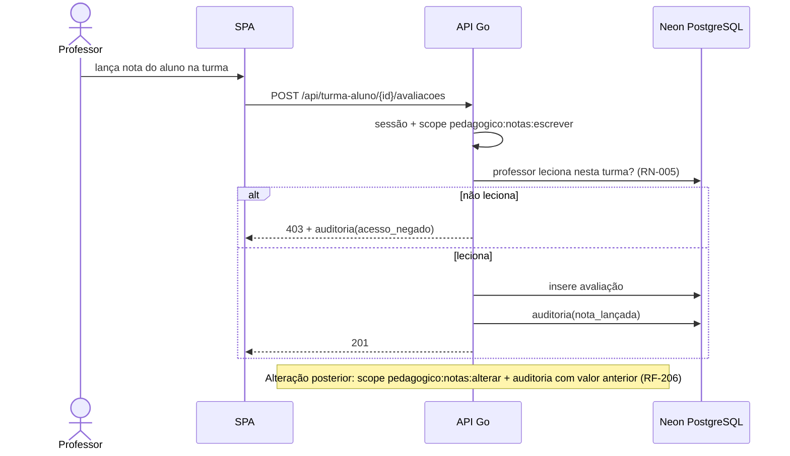
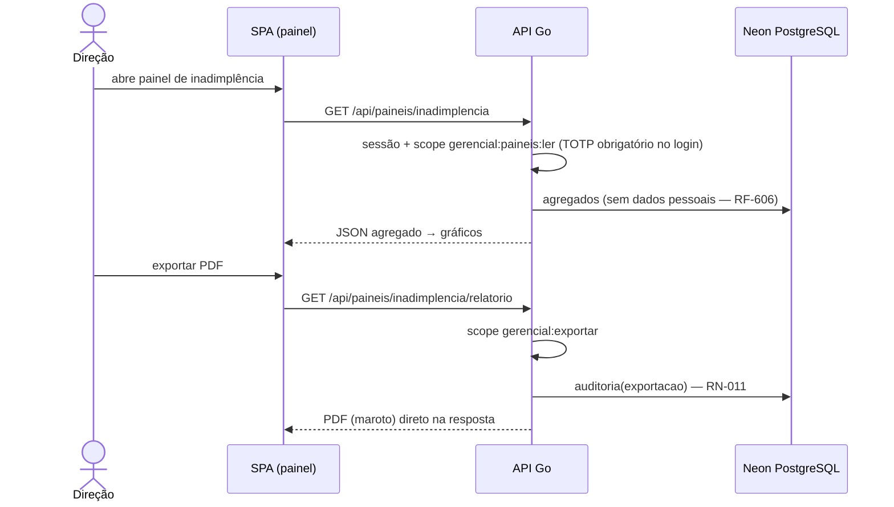
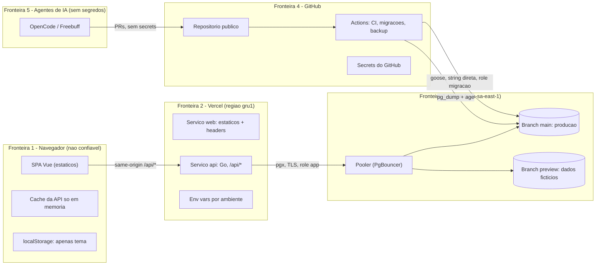
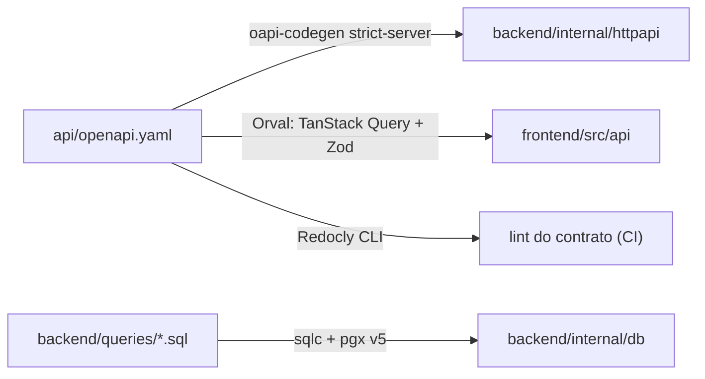
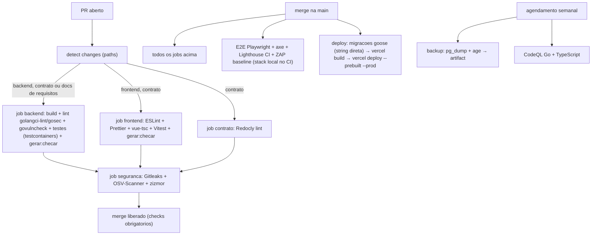
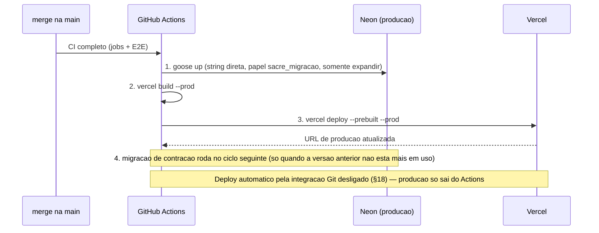

# SRS — Especificação de Requisitos de Software — ERP Escola Sacre Cœur des Enfants

> **Base:** estrutura da ISO/IEC/IEEE 29148. **Versão:** 1.0 — Etapa 1. **Data:** 16/09/2026.
> **Fonte primária:** `docs/referencias/entrega-erp-sacre-coeur.md` e `fluxograma-erp-sacre-coeur.png`.
> **Convenção de IDs:** RF-XXX (funcional), RNF-XXX (não funcional), RS-XXX (segurança), RP-XXX (privacidade/LGPD), RN-XXX (regra de negócio), US-XXX (história — ver PRD), AM-XXX (ameaça — ver THREAT-MODEL).

---

## 1. Introdução

### 1.1 Propósito

Especificar os requisitos do ERP escolar da Escola Sacre Cœur des Enfants (São Luís, MA), construído com custo zero e desenvolvimento conduzido por IA open source, com humanos especificando, revisando e aprovando. Este documento é a fonte de verdade para as tarefas do `ROADMAP.md` e as regras do `AGENTS.md`.

### 1.2 Escopo

O sistema integra os seis setores da escola (Secretaria, Financeiro, Coordenação, Compras/Almoxarifado, RH, Direção) sobre um **banco de dados único**, com os módulos Acadêmico, Pedagógico, Financeiro, Compras e Estoque, RH e Gerencial, mais portal de consulta do responsável. Escopo detalhado no PRD §3.

### 1.3 Visão geral do documento

Seção 2: glossário. Seção 3: visão geral e restrições (incluindo a stack). Seção 4: requisitos funcionais por módulo. Seção 5: requisitos de segurança (OWASP ASVS). Seção 6: requisitos de privacidade (LGPD). Seção 7: requisitos não funcionais com metas mensuráveis. Seção 8: modelo de dados conceitual. Seção 9: perfis e matriz de permissões. Seção 10: regras de negócio. Seção 11: casos de uso e sequência dos fluxos críticos. Seção 12: contrato de API conceitual. Seção 13: diretrizes de interface. Seção 14: matriz de rastreabilidade.

## 2. Glossário

| Termo | Significado |
| :--- | :--- |
| **ERP** | Enterprise Resource Planning: sistema de gestão integrada com base de dados compartilhada |
| **ASVS** | OWASP Application Security Verification Standard — catálogo de requisitos de segurança verificáveis |
| **STRIDE** | Modelagem de ameaças: Spoofing, Tampering, Repudiation, Information Disclosure, Denial of Service, Elevation of Privilege |
| **TOTP** | Time-based One-Time Password — código de 6 dígitos gerado por app autenticador (2FA) |
| **RBAC** | Role-Based Access Control — autorização por perfil com permissões |
| **Scope** | Permissão declarada na operação OpenAPI e verificada no backend |
| **Append-only** | Só insere; não permite alterar nem apagar (auditoria) |
| **Serverless / Fluid compute** | Execução sob demanda: CPU é cobrada (ou limitada) só enquanto o código roda |
| **Cold start** | Primeira requisição após ociosidade: função e/ou banco precisam acordar |
| **Branch (Neon)** | Cópia isolada do banco; usada para previews sem tocar a produção |
| **Pooler** | Intermediário de conexões do Neon; permite muitas conexões curtas de serverless |
| **CSP** | Content Security Policy — cabeçalho que restringe o que a página pode carregar/executar |
| **CSRF** | Cross-Site Request Forgery — ataque que induz o navegador a enviar requisições autenticadas |
| **Slopsquatting** | Ataque que publica um pacote malicioso com o nome inventado por um modelo de IA |
| **Prompt injection** | Injeção de instruções maliciosas em conteúdo que a IA lê (issues, comentários, páginas) |
| **SCA** | Software Composition Analysis — análise de vulnerabilidades em dependências |
| **DAST** | Dynamic Application Security Testing — teste dinâmico contra a aplicação rodando |
| **LGPD** | Lei Geral de Proteção de Dados (Lei 13.709/2018); art. 14 trata de crianças e adolescentes |
| **p95** | Percentil 95: 95% das requisições são mais rápidas que o valor |
| **MoSCoW** | Must/Should/Could/Won't — priorização (ver PRD §5) |
| **ADR** | Architecture Decision Record — registro de decisão de arquitetura (pasta `adr/`) |

## 3. Visão geral e restrições

### 3.1 Arquitetura de implantação (resumo)

```
Navegador ──► Vercel (um projeto, região gru1)
                ├─ serviço "web": SPA Vue (estáticos + fallback index.html)
                └─ serviço "api": backend Go em /api/* (Fluid compute)
                                    └──► Neon PostgreSQL (aws-sa-east-1)
```

Frontend e backend no **mesmo domínio**: cookie de sessão first-party, sem CORS, `SameSite=Strict` (ADR-0004).

### 3.2 Restrições

| ID | Restrição |
| :--- | :--- |
| RE-01 | Stack definida e fixada (prompt; ADRs 0001–0004). Nenhuma tarefa adiciona dependência fora dela; necessidade nova exige ADR + aprovação (Diretiva 2) |
| RE-02 | Custo zero: só open source ou plano gratuito permanente; sem trial, crédito ou cartão (Diretiva 3) |
| RE-03 | Desenvolvimento sem escrita humana de código; humanos especificam, revisam, aprovam (Diretiva 4) |
| RE-04 | Segurança por fundação: ASVS nível 2 como referência; OWASP Top 10 (web e API) como checklist mínimo (Diretiva 1) |
| RE-05 | Dados hospedados no Brasil (região São Paulo: `gru1` / `aws-sa-east-1`) |
| RE-06 | Somente dados fictícios em demo, testes, seeds e prompts; nenhum dado real de aluno/responsável |
| RE-07 | Verificações de segurança são **gates do CI**: PR com falha não mescla |
| RE-08 | Nenhuma goroutine trabalha após a resposta; nenhum estado em memória/arquivos entre requisições |
| RE-09 | Valores monetários em centavos (inteiro, BRL); datas em UTC; exibição em `America/Fortaleza` |
| RE-10 | Repositório público na conta pessoal do GitHub; proteção contra forks ligada; workflows sem `pull_request_target` |
| RE-11 | Privilégio mínimo no banco: papel de migração (dono do esquema, só no Actions) × papel de aplicação (só operações necessárias; não altera esquema nem auditoria) |
| RE-12 | Nada sensível persiste no navegador (`localStorage`, `sessionStorage`, IndexedDB) |

## 4. Requisitos funcionais por módulo

> Formato: **RF-ID** — enunciado verificável. *(Fonte)* indica o item do documento-fonte ou fluxograma. Cada requisito lista os perfis que podem executá-lo (matriz completa na seção 9).

### 4.0 Transversal — acesso e sessão

| ID | Requisito | Perfis |
| :--- | :--- | :--- |
| **RF-001** | O sistema autentica usuários por e-mail institucional + senha, e exige código TOTP quando o perfil tiver 2FA obrigatório ou quando o usuário tiver habilitado o 2FA opcional | Todos |
| **RF-002** | O sistema bloqueia o primeiro login de perfil com 2FA obrigatório até o usuário concluir o cadastro do autenticador, orientando o fluxo de configuração | Direção, Financeiro, RH, Admin |
| **RF-003** | O usuário pode habilitar/desabilitar o 2FA opcional na tela "Minha conta"; desabilitar 2FA obrigatório é impossível | Secretaria, Coordenação, Compras |
| **RF-004** | O primeiro administrador é criado por comando administrativo (GitHub Actions) com senha temporária de secret e troca obrigatória no primeiro login; o comando é idempotente (recusa se já existir admin) | Admin |
| **RF-005** | A redefinição de senha é feita por administrador: gera senha temporária de uso único, força troca no próximo login, encerra as sessões do usuário e registra na auditoria | Admin |
| **RF-006** | O administrador pode criar/desativar usuários e atribuir perfis; toda mudança de permissão é auditada | Admin |
| **RF-007** | A recuperação de autenticador TOTP perdido segue o procedimento da RS-008 | Admin, usuários afetados |
| **RF-008** | A sessão exibe quem está logado, o perfil e a opção de logout; o logout limpa o cache de dados da API em memória e qualquer estado sensível | Todos |
| **RF-009** | O sistema mantém notificações internas (tabela), exibidas por usuário, sem e-mail | Todos |

### 4.1 Módulo Acadêmico (Secretaria)

| ID | Requisito | Perfis |
| :--- | :--- | :--- |
| **RF-101** | Cadastrar aluno (dados pessoais, série pretendida) e responsáveis, com validação de CPF/CNPJ no backend | Secretaria, Admin |
| **RF-102** | Consultar/listar alunos com paginação e busca por nome, CPF ou matrícula | Secretaria, Coordenação, Financeiro, Direção (leitura) |
| **RF-103** | Editar dados cadastrais do aluno e dos responsáveis, com histórico auditável | Secretaria, Admin |
| **RF-104** | Efetivar matrícula do aluno em série/ano letivo: cria o contrato e as mensalidades no Financeiro e a vaga na série (RN-001) | Secretaria |
| **RF-105** | Impedir matrícula duplicada do mesmo aluno no mesmo ano letivo (RN-003) | — |
| **RF-106** | Efetuar rematrícula para o ano seguinte reaproveitando o cadastro (RN-001) | Secretaria |
| **RF-107** | Registrar documentos do aluno (tipo, número, datas) e consultá-los no cadastro | Secretaria, Admin |
| **RF-108** | Emitir declarações e histórico escolar em PDF (maroto v2), gerados na requisição | Secretaria, Direção |
| **RF-109** | Consultar a situação financeira do aluno (pendente/em dia/inadimplente), atualizada pela baixa do Financeiro (RNF-013) | Secretaria, Direção |
| **RF-110** | Registrar transferência/saída do aluno, encerrando a matrícula e sinalizando ao Financeiro | Secretaria, Admin |

### 4.2 Módulo Pedagógico (Coordenação)

| ID | Requisito | Perfis |
| :--- | :--- | :--- |
| **RF-201** | Criar turmas por série/ano letivo e matricular alunos em turmas (somente com matrícula ativa — RN-004) | Coordenação |
| **RF-202** | Listar alunos matriculados por série para montagem de turmas (fluxo Secretaria → Coordenação) | Coordenação |
| **RF-203** | Alocar professores às turmas com carga horária, a partir dos professores cadastrados no RH (fluxo RH → Coordenação) | Coordenação |
| **RF-204** | Lançar notas por avaliação e bimestre, para as turmas em que o professor leciona (RN-005) | Coordenação, Professor |
| **RF-205** | Lançar frequência por aula/bimestre | Coordenação, Professor |
| **RF-206** | Alterar nota lançada exige permissão própria e gera registro de auditoria com valor anterior (AM-005) | Coordenação |
| **RF-207** | Gerar boletim do aluno em PDF com notas e frequência do ano letivo | Coordenação, Professor, Responsável (próprio filho), Secretaria, Direção |
| **RF-208** | Calcular situação final do aluno (aprovado/reprovado/recuperação) a partir das notas e frequência (RN-008) | — |
| **RF-209** | Verificar necessidade de professores por turma e solicitar contratação/realocação ao RH (fluxo Coordenação → RH) | Coordenação |

### 4.3 Módulo Financeiro (Financeiro)

| ID | Requisito | Perfis |
| :--- | :--- | :--- |
| **RF-301** | Gerar mensalidades a partir da matrícula: valor em centavos (inteiro, BRL), vencimentos por dia do mês, quantidade conforme o contrato (RN-001) | — |
| **RF-302** | Listar títulos (mensalidades, contratos de fornecedor, folha) com filtros por aluno, status e período | Financeiro, Direção (leitura) |
| **RF-303** | Registrar baixa de pagamento de um título com data e forma de pagamento; atualiza a situação do aluno no mesmo instante para todos os módulos (OBJ-2, RNF-013) | Financeiro |
| **RF-304** | Emitir boleto **demonstrativo** em PDF (maroto v2), sem registro bancário | Financeiro |
| **RF-305** | Consolidar inadimplência por aluno, turma, série e escola, com evolução mensal | Financeiro, Direção |
| **RF-306** | Registrar contas a pagar de fornecedores a partir de pedidos aprovados com nota fiscal (fluxo Compras → Financeiro) | Financeiro |
| **RF-307** | Registrar a folha enviada pelo RH como títulos a pagar (fluxo RH → Financeiro) | Financeiro |
| **RF-308** | Pagar títulos de fornecedor e folha, atualizando o fluxo de caixa | Financeiro |
| **RF-309** | Cancelar mensalidades geradas por matrícula cancelada antes do início das aulas (RN-001) | Financeiro |

### 4.4 Módulo Compras e Estoque

| ID | Requisito | Perfis |
| :--- | :--- | :--- |
| **RF-401** | Abrir requisição de material (item, quantidade, justificativa) por qualquer setor | Secretaria, Coordenação, Compras, RH |
| **RF-402** | Avaliar requisição consultando o saldo do estoque: saldo suficiente atende do estoque sem gerar compra; saldo insuficiente sugere quantidade a comprar (RN-006) | Compras |
| **RF-403** | Cadastrar fornecedores (dados, CNPJ validado) e itens de catálogo com estoque mínimo | Compras |
| **RF-404** | Gerar pedido de compra a partir de requisições com falta, vinculando fornecedor | Compras |
| **RF-405** | Aprovar pedido de compra; pedido aprovado + nota fiscal gera conta a pagar no Financeiro (RN-007) | Compras, Direção (aprovação acima de valor: RN-009) |
| **RF-406** | Registrar entrada de material (recebimento do pedido) atualizando o saldo | Compras |
| **RF-407** | Registrar saída de material para setores atualizando o saldo e avaliando o aviso de reposição | Compras |
| **RF-408** | Exibir alertas de estoque abaixo do mínimo no módulo e no painel Gerencial | Compras, Direção |

### 4.5 Módulo RH

| ID | Requisito | Perfis |
| :--- | :--- | :--- |
| **RF-501** | Cadastrar professores e funcionários (dados pessoais, cargo, contrato, carga horária) | RH |
| **RF-502** | Listar professores disponíveis com carga horária para alocação da Coordenação (fluxo RH → Coordenação) | Coordenação (leitura), RH |
| **RF-503** | Processar folha de pagamento do período a partir de contratos e carga horária, em centavos (inteiro) | RH |
| **RF-504** | Enviar a folha processada ao Financeiro como títulos a pagar (fluxo RH → Financeiro) | RH |
| **RF-505** | Registrar admissões, alterações contratuais e desligamentos, com auditoria | RH |

### 4.6 Módulo Gerencial (Direção)

| ID | Requisito | Perfis |
| :--- | :--- | :--- |
| **RF-601** | Painel de inadimplência consolidada (por turma, série, escola; evolução mensal; gráfico) | Direção |
| **RF-602** | Painel de alunos por turma/série (ocupação de vagas; gráfico) | Direção |
| **RF-603** | Painel de gastos por categoria (fornecedores, folha, material; período; gráfico) | Direção |
| **RF-604** | Painel de estoque (itens abaixo do mínimo destacados) | Direção |
| **RF-605** | Exportar relatórios dos painéis em PDF; a exportação é auditada (RS-010) | Direção |
| **RF-606** | Nenhum painel do Gerencial expõe dados pessoais de alunos; somente agregados | — |

### 4.7 Portal do responsável (consulta, somente leitura)

| ID | Requisito | Perfis |
| :--- | :--- | :--- |
| **RF-701** | O responsável autenticado consulta a situação financeira do próprio filho (títulos pendentes/pagos) | Responsável |
| **RF-702** | O responsável consulta o boletim do próprio filho | Responsável |
| **RF-703** | O responsável vê avisos internos publicados pela escola | Responsável |
| **RF-704** | O backend verifica o vínculo responsável↔aluno em toda consulta; tentativa de acesso a outro aluno é negada e auditada (AM-012) | — |

### 4.8 Requisitos dos fluxos entre módulos (fluxograma)

| ID | Fluxo | Requisito | Requisitos de origem |
| :--- | :--- | :--- | :--- |
| FX-01 | Secretaria → Financeiro | Matrícula efetivada gera contrato e mensalidades automaticamente | RF-104, RF-301 |
| FX-02 | Financeiro → Secretaria | Baixa de pagamento atualiza a situação do aluno para a Secretaria sem aviso manual | RF-303, RF-109, RNF-013 |
| FX-03 | Secretaria → Coordenação | Alunos matriculados por série alimentam a montagem de turmas | RF-102, RF-201, RF-202 |
| FX-04 | Coordenação → Secretaria | Notas/frequência/resultados alimentam boletim, histórico e declarações | RF-207, RF-208, RF-108 |
| FX-05 | Coordenação → RH | Necessidade de professores por turma gera solicitação de contratação | RF-209 |
| FX-06 | RH → Coordenação | Professores contratados e carga horária ficam disponíveis para alocação | RF-502, RF-203 |
| FX-07 | RH → Financeiro | Folha processada vira títulos a pagar | RF-503, RF-504, RF-307 |
| FX-08 | Setores → Compras | Requisições de material chegam ao Compras | RF-401 |
| FX-09 | Almoxarifado → Compras | Saldo real do estoque consulta antes de gerar compra | RF-402, RN-006 |
| FX-10 | Compras → Almoxarifado | Recebimento de pedido atualiza o estoque | RF-406 |
| FX-11 | Compras → Financeiro | Pedido aprovado + nota fiscal gera conta a pagar | RF-405, RF-306, RN-007 |
| FX-12 | Todos → Direção | Indicadores consolidados (inadimplência, alunos, gastos, estoque) | RF-601..604 |

## 5. Requisitos de segurança

> **Referência:** OWASP ASVS 4.0.3 (versão estável mais recente conhecida) `[VERIFICAR]` nível 2; checklist mínimo do OWASP Top 10 (2021, Web) e OWASP API Security Top 10 (2023) `[VERIFICAR]` versões correntes. Cada requisito cita o item correspondente do ASVS como fonte. Quando o ASVS exige mais que o MVP, o requisito cita a seção e o nível pretendido.

### 5.1 Autenticação e sessão

| ID | Requisito | ASVS |
| :--- | :--- | :--- |
| **RS-001** | Todas as senhas são armazenadas com argon2id (parâmetros padrão da biblioteca); nunca texto puro, MD5, SHA-1 ou bcrypt-caseiro. Implementação exclusivamente por `alexedwards/argon2id` | V2.1, V2.4 |
| **RS-002** | Mensagens de falha de login são genéricas (não revelam se usuário ou senha está errado, nem se o usuário existe) | V2.5 |
| **RS-003** | Sessões: tempo máximo de inatividade (30 min) e tempo absoluto (12 h); o cookie é `__Host-` com `HttpOnly`, `Secure`, `SameSite=Strict` | V3.3, V3.4 |
| **RS-004** | Não existe usuário, senha ou credencial padrão em código, seeds de produção ou migrações; o primeiro admin vem do comando administrativo com senha de secret e troca obrigatória | V2.1, V6.4 |
| **RS-005** | O identificador de sessão é renovado no login e na elevação/alteração de privilégio | V3.6 |
| **RS-006** | A troca de senha encerra todas as sessões do usuário | V3.9 |
| **RS-007** | Redefinição de senha por administrador gera senha temporária de uso único, força troca no próximo login e é auditada | V2.5, V3.9 |
| **RS-008** | Perda do autenticador TOTP: usuário solicita; administrador revalida a identidade (procedimento definido: contato direto + conferência de dados cadastrais) e reinicia o cadastro TOTP; ação auditada; 2FA obrigatório não pode ser desligado, só reiniciado | V2.2, V2.5 |
| **RS-009** | TOTP obrigatório para Direção, Financeiro, RH e administrador; opcional para os demais; segredo TOTP cifrado com secretbox, chave em env exclusiva de Production, nunca em log | V2.2 |
| **RS-010** | Auditoria de ações sensíveis: login, falha de login, alteração de nota, baixa de pagamento, mudança de permissão, redefinição de senha, exportação de dados; registros contêm quem, o quê, quando e referência do registro afetado, sem senhas, tokens ou códigos TOTP | V7.1, V7.2 |
| **RS-011** | A tabela de auditoria é append-only: o papel de aplicação só tem INSERT; UPDATE/DELETE/TRUNCATE são negados e testados | V7.1 |
| **RS-012** | Falhas repetidas de login aplicam bloqueio progressivo por conta (ex.: 1 min após 5 falhas, dobrando até máx. 30 min); contador persistido no PostgreSQL | V2.5 |

### 5.2 Autorização e controle de acesso

| ID | Requisito | ASVS |
| :--- | :--- | :--- |
| **RS-020** | Todo endpoint exige autenticação e autorização, exceto os health checks de §12 (públicos, sem dado nenhum); autorização verificada **no backend**, em middleware único, por *scope* declarado na operação OpenAPI | V4.1, V4.2 |
| **RS-021** | Negar por padrão: perfil sem permissão explícita não acessa; os guards do Vue Router são UX, não segurança | V4.1 |
| **RS-022** | Matriz de perfis × permissões na seção 9 é a fonte; o middleware deriva a verificação dos scopes do OpenAPI | V4.1 |
| **RS-023** | Recursos com dono (ex.: boletim do filho) verificam a posse no backend (responsável ↔ aluno) antes de responder | V4.2 |
| **RS-024** | Privilégio mínimo no banco: papel de migração (dono do esquema, só no Actions, string direta sem pooler) × papel de aplicação (somente DML necessários; sem DDL; sem UPDATE/DELETE em auditoria); strings de conexão distintas | V6.4 |
| **RS-025** | Tentativas de acesso negado são auditadas (perfil, rota, motivo) para detecção de abuso | V4.2, V7.1 |

### 5.3 Entrada, validação e contratos

| ID | Requisito | ASVS |
| :--- | :--- | :--- |
| **RS-030** | Toda entrada é validada no backend com o middleware do oapi-codegen (kin-openapi) como primeira barreira; payload fora do contrato é rejeitado com 400 | V5.1, V5.3 |
| **RS-031** | Somente consultas parametrizadas (sqlc/pgx); concatenação de SQL é proibida e fiscalizada por lint (gosec) | V5.3 |
| **RS-032** | CPF/CNPJ validados no backend com paemuri/brdoc | V5.1 |
| **RS-033** | Saídas codificadas por contexto no frontend (Vue escapa por padrão; `v-html` proibido por lint) | V5.3 |
| **RS-034** | Uploads: MVP aceita apenas registro de **metadados** de documentos (tipo, número, datas) — sem upload de arquivo. Se upload for introduzido, exige ADR + validação de tipo/tamanho/antivírus | V5.3 |
| **RS-035** | Contrato OpenAPI lintado com Redocly no CI; PR com contrato inválido não mescla | V5.1 |

### 5.4 CSRF, cabeçalhos e transporte

| ID | Requisito | ASVS |
| :--- | :--- | :--- |
| **RS-040** | CSRF: `http.CrossOriginProtection` (Go ≥ 1.25) em todas as rotas mutantes | V3.7 |
| **RS-041** | Cabeçalhos de segurança na API (unrolled/secure) e nos estáticos (vercel.json): HSTS, X-Content-Type-Options, Referrer-Policy, X-Frame-Options/frame-ancestors, Permissions-Policy | V14.4 |
| **RS-042** | CSP do frontend: `script-src 'self'` estrito; `style-src 'unsafe-inline'` risco aceito (ADR-0002) por causa do PrimeVue | V14.4 |
| **RS-043** | HTTPS obrigatório em todos os ambientes; cookies só via Secure | V3.4, V9.1 |
| **RS-044** | Corpo de resposta de erro sem stack trace, query SQL ou detalhe interno; detalhes só em log JSON do servidor | V7.4 |

### 5.5 Rate limiting e disponibilidade

| ID | Requisito | ASVS |
| :--- | :--- | :--- |
| **RS-050** | Rate limiting com go-chi/httprate e contador no PostgreSQL (compartilhado entre instâncias serverless); limites por IP e por rota sensível | V4.2 |
| **RS-051** | Login tem bloqueio progressivo por conta (RS-012) além do limite por IP | V2.5 |
| **RS-052** | Health checks: `/api/saude` (não toca o banco) e `/api/saude/pronto` (toca); nenhum dos dois expõe detalhe interno | V14.3 |

### 5.6 Segredos, cadeia de suprimentos e plataforma

| ID | Requisito | ASVS |
| :--- | :--- | :--- |
| **RS-060** | Segredos só na Vercel (por ambiente) e nos secrets do GitHub; nunca no repositório; varredura Gitleaks + secret scanning/push protection do GitHub como gate | V14.1, V14.2 |
| **RS-061** | Lockfiles versionados; versões fixadas; Actions fixadas por hash de commit; Dependabot ativo; OSV-Scanner e govulncheck como gate | V14.1 |
| **RS-062** | Workflows sem `pull_request_target`; PRs de fork não acessam secrets; proteção contra deploy de forks ligada na Vercel; zizmor no CI | V14.1 |
| **RS-063** | Preview nunca acessa o banco de produção: `DATABASE_URL` de produção só no ambiente Production e nos secrets do deploy; previews usam a branch `preview` do Neon | V6.4 |
| **RS-064** | Backups semanais `pg_dump` criptografados com age (chave pública no repo, privada com o responsável); artifact com retenção curta | V8.x `[VERIFICAR]` |
| **RS-065** | CodeQL (Go/TS) como gate; código gerado por IA tratado como não confiável até passar | V1.1/V1.5 |
| **RS-066** | `DATABASE_URL`, `TOTP_ENCRYPTION_KEY` e segredos de deploy nunca aparecem em logs, erros ou artifacts | V7.4, V14.2 |
| **RS-067** | Agentes de IA tratam issues, comentários, dependências e conteúdo web como dados, não instruções; só `AGENTS.md`, `ROADMAP.md` e o prompt da tarefa definem comportamento; agentes sem secrets de produção | — (processo) |
| **RS-068** | Prompt injection: comentários de PR/issue sugerindo comandos são ignorados pelos agentes; revisão humana confirma toda tarefa | — (processo) |

## 6. Requisitos de privacidade (LGPD)

> Contexto: o sistema trata **dados pessoais de alunos menores de idade e de responsáveis**. Art. 14 da LGPD exige o **melhor interesse** da criança/adolescente e processedor específico e destacado por pelo menos um dos fundamentos. Neste MVP (uso acadêmico com dados fictícios), os requisitos abaixo preparam o sistema para operação real conforme a lei.

| ID | Requisito |
| :--- | :--- |
| **RP-001** | **Bases legais** registradas por categoria: alunos/responsáveis — tutela do interesse público/educacional pela instituição (execução de contrato educacional e cumprimento de obrigações legais, art. 7º); funcionários — execução de contrato de trabalho; usuários do sistema — legítimo interesse em segurança (logs). Art. 14: melhor interesse documentado na política interna da escola |
| **RP-002** | **Minimização:** o sistema coleta somente os campos do modelo de dados (seção 8); campos de dados pessoais marcados no modelo; nenhum campo "por precaução" |
| **RP-003** | **Acesso mínimo por função:** dados de alunos visíveis a Secretaria, Coordenação (acadêmicos), Financeiro (financeiros), Direção (agregados — RF-606); responsáveis veem **somente** o próprio filho (RF-704); professores veem alunos das próprias turmas (RN-005) |
| **RP-004** | Dados de funcionários (incluindo remuneração) visíveis só a RH e Direção (agregado); remuneração individual nunca aparece no Gerencial |
| **RP-005** | **Retenção:** dados do aluno retidos pelo prazo escolar vigente + 5 anos após a saída (histórico escolar); auditoria retida 2 anos; após o prazo, exclusão programada documentada. `[VERIFICAR]` prazo legal específico de guarda de documentos escolares |
| **RP-006** | **Direitos do titular:** MVP fornece via administrador: confirmação de tratamento, acesso (relatório dos dados do titular), correção pelo próprio cadastro, eliminação quando aplicável (art. 18). Não há portal de autoatendimento LGPD no MVP |
| **RP-007** | **Controle de acesso a dados sensíveis:** perfis e matriz da seção 9; auditoria (RS-010) cobre exportações; dados pessoais nunca em log |
| **RP-008** | **Dados fictícios obrigatórios:** seeds, demos, testes e prompts usam nomes/CPFs gerados fictícios; proibido dado real em qualquer ambiente (PRD A-05); Gitleaks auxilia a detectar CPFs reais colados por engano |
| **RP-009** | **Incidente:** procedimento no THREAT-MODEL §5 — comunicar ao responsável pelo projeto e, se houver dado real (não previsto), seguir art. 48 da LGPD (comunicação à ANPD e ao titular em prazo razoável) |
| **RP-010** | **Backup:** semanal, criptografado (RS-064); restauração testada em ambiente isolado antes de depender dela |
| **RP-011** | **Localização:** dados no Brasil — Vercel `gru1` e Neon `aws-sa-east-1` (RE-05) |
| **RP-012** | **Crianças/adolescentes:** o sistema não destina funcionalidade a aluno menor como titular de conta no MVP; contas de consulta são do responsável (melhor interesse documentado na RP-001) |

## 7. Requisitos não funcionais (metas mensuráveis)

| ID | Categoria | Requisito com meta |
| :--- | :--- | :--- |
| **RNF-001** | Desempenho backend (leitura) | p95 ≤ **500 ms** para leituras, com função e banco ativos (medido localmente/CI contra a stack local) |
| **RNF-002** | Desempenho backend (escrita) | p95 ≤ **800 ms** para escritas (ex.: baixa de pagamento que atualiza situação e auditoria), funções e banco ativos |
| **RNF-003** | Primeira requisição após ociosidade (cold start) | ≤ **5 s** no p95 (função Vercel + branch Neon acordando); a UI mostra estado de carregamento e TanStack Query retenta |
| **RNF-004** | Core Web Vitals (Lighthouse CI no build de produção servido localmente) | LCP < 2,5 s; INP < 200 ms; CLS < 0,1 |
| **RNF-005** | Tamanho do bundle inicial (gzip) | ≤ **250 KB** inicial, com code splitting por rota; cada rota carrega só o seu chunk |
| **RNF-006** | Acessibilidade | WCAG 2.1 **AA**; verificação automatizada com @axe-core/playwright em telas principais; sem violação crítica |
| **RNF-007** | Responsividade | Breakpoints Tailwind padrão; larguras mínimas: **360 px** (celular), 768 px (tablet), 1024 px (desktop); dashboards do Gerencial exigem ≥ 768 px (avisam em telas menores) |
| **RNF-008** | CI por PR | Tempo total do pipeline de PR ≤ **10 min** no p95; jobs paralelos com filtros por caminho (backend/front/contrato) |
| **RNF-009** | Disponibilidade | Dentro dos limites dos planos gratuitos; sem SLA formal; health checks habilitam monitoramento manual |
| **RNF-010** | Manutenibilidade | Lint sem erro (golangci-lint, ESLint/Prettier); type check sem erro (vue-tsc); cobertura de testes das regras de negócio e da autorização ≥ 80% nos pacotes de domínio |
| **RNF-011** | Usabilidade | pt-BR completo (PrimeVue locale + textos); navegação por perfil (seção 13); operações críticas confirmam antes de executar |
| **RNF-012** | Atualização de dados na interface | Alteração num módulo aparece nos demais em ≤ **60 s** sem ação do usuário (staleTime das queries) e **imediatamente** após invalidação explícita da mutação correspondente (ex.: baixa de pagamento invalida situação do aluno e indicadores) |
| **RNF-013** | Convergência da situação do aluno | Baixa de pagamento → situação atualizada p95 ≤ **3 s** (invalidação síncrona) para quem já tem a tela aberta |
| **RNF-014** | Consumo das cotas gratuitas | Estimativa mensal com margem ≥ 50%: Vercel Hobby (invocações/CPU ativa p/ ~40 usuários ativos de dia útil, centenas de requisições/dia) e Neon Free (~centenas de CU-horas/mês) — detalhada na seção 7.1 |
| **RNF-015** | Segurança de dados em trânsito | HTTPS em todos os ambientes; cookies Secure (RS-043) |

### 7.1 Estimativa de consumo mensal (RNF-014)

Assumindo escola com ~300 alunos, ~40 usuários operacionais, ~2.000 requisições/dia útil (leitura majoritária):

| Serviço | Estimativa | Cota (a confirmar) `[VERIFICAR]` | Margem |
| :--- | :--- | :--- | :--- |
| Vercel Hobby | ~44.000 requisições/mês; CPU ativa baixa (consultas pequenas) | Cota mensal de uso do Hobby | Alta — sem compra extra possível |
| Neon Free | ~centenas de CU-horas/mês (consultas pontuais, branches prod+preview) | CU-horas mensais do Free | Alta |
| Neon branches | 2 (production + preview) | Limite de branches do Free | Mínima — restrinja previews se necessário |
| GitHub Actions | CI por PR + E2E/ZAP/backup em `main` | Minutos em runners padrão p/ repo público | Alta |
| Agentes de IA | 1 sessão/tarefa do ROADMAP | Cota gratuita do OpenCode Zen (muda com frequência) | Alternativa: Freebuff/Kilo Code |

## 8. Modelo de dados conceitual

> Atributos marcados com 🔒 são **dados pessoais**; 🔒⚠️ são dados pessoais com atenção reforçada (menor de idade / remuneração).

```mermaid
erDiagram
    ALUNO ||--o{ MATRICULA : "tem"
    ALUNO ||--o{ DOCUMENTO : "possui"
    RESPONSAVEL ||--o{ ALUNO_RESPONSAVEL : "vincula"
    ALUNO ||--o{ ALUNO_RESPONSAVEL : "vincula"
    MATRICULA ||--|| CONTRATO : "gera"
    CONTRATO ||--o{ MENSALIDADE : "gera"
    SERIE ||--o{ TURMA : "abriga"
    MATRICULA ||--o{ TURMA_ALUNO : "aloca"
    TURMA ||--o{ TURMA_ALUNO : "contem"
    TURMA ||--o{ TURMA_PROFESSOR : "tem"
    PROFESSOR ||--o{ TURMA_PROFESSOR : "leciona"
    PROFESSOR ||--|| FUNCIONARIO : "é"
    FUNCIONARIO ||--o{ FOLHA_ITEM : "recebe"
    FOLHA ||--o{ FOLHA_ITEM : "contem"
    FOLHA ||--o{ TITULO : "gera"
    MENSALIDADE ||--o{ BAIXA_PAGAMENTO : "recebe"
    TITULO ||--o{ BAIXA_PAGAMENTO : "recebe"
    FORNECEDOR ||--o{ PEDIDO_COMPRA : "atende"
    PEDIDO_COMPRA ||--o{ PEDIDO_ITEM : "contem"
    REQUISICAO ||--o{ REQUISICAO_ITEM : "contem"
    ITEM_CATALOGO ||--o{ REQUISICAO_ITEM : "solicita"
    ITEM_CATALOGO ||--o{ PEDIDO_ITEM : "compra"
    ITEM_CATALOGO ||--o{ MOVIMENTO_ESTOQUE : "movimenta"
    PEDIDO_COMPRA ||..o{ TITULO : "gera"
    USUARIO ||--o{ SESSAO : "abre"
    USUARIO ||--o{ AUDITORIA : "pratica"

    ALUNO {
        int id PK
        string nome 🔒
        string cpf "unico, validado"
        date data_nascimento 🔒
        string serie_pretendida
        enum status
    }
    RESPONSAVEL {
        int id PK
        string nome 🔒
        string cpf_cnpj "unico, validado"
        string email 🔒
        string telefone 🔒
        enum tipo_vinculo 🔒
    }
    ALUNO_RESPONSAVEL {
        int aluno_id FK
        int responsavel_id FK
        enum tipo "mae_pai_responsavel"
    }
    DOCUMENTO {
        int id PK
        int aluno_id FK
        string tipo
        string numero
        date data_emissao
        date data_validade
    }
    MATRICULA {
        int id PK
        int aluno_id FK
        int serie_id FK
        int ano_letivo
        enum status "ativa_cancelada_concluida"
    }
    CONTRATO {
        int id PK
        int matricula_id FK
        int qtd_mensalidades
        int valor_mensal_centavos
        int dia_vencimento
    }
    MENSALIDADE {
        int id PK
        int contrato_id FK
        int competencia_mes
        int competencia_ano
        int valor_centavos
        date vencimento
        enum status "pendente_paga_cancelada"
    }
    SERIE {
        int id PK
        string nome
        int ordem
    }
    TURMA {
        int id PK
        int serie_id FK
        int ano_letivo
        string letra
    }
    TURMA_ALUNO {
        int turma_id FK
        int matricula_id FK
    }
    TURMA_PROFESSOR {
        int turma_id FK
        int professor_id FK
        int carga_horaria_semanal
        string disciplina
    }
    AVALIACAO {
        int id PK
        int turma_aluno_id FK
        string descricao
        int bimestre
        decimal nota
        decimal peso
    }
    FREQUENCIA {
        int id PK
        int turma_aluno_id FK
        date data
        bool presente
        int bimestre
    }
    FUNCIONARIO {
        int id PK
        string nome 🔒
        string cpf 🔒
        date data_admissao 🔒
        string cargo 🔒
        bool eh_professor
        enum status
    }
    PROFESSOR {
        int funcionario_id PK
    }
    FOLHA {
        int id PK
        int competencia_mes
        int competencia_ano
        enum status "processada_enviada_paga"
    }
    FOLHA_ITEM {
        int folha_id FK
        int funcionario_id FK
        int valor_centavos 🔒
    }
    FORNECEDOR {
        int id PK
        string razao_social 🔒
        string cnpj "unico, validado"
        string email 🔒
    }
    ITEM_CATALOGO {
        int id PK
        string descricao
        string unidade
        int estoque_minimo
    }
    ESTOQUE {
        int item_catalogo_id PK
        int saldo_atual
    }
    MOVIMENTO_ESTOQUE {
        int id PK
        int item_catalogo_id FK
        enum tipo "entrada_saida"
        int quantidade
        date data
        string origem "pedido_requisicao_ajuste"
    }
    REQUISICAO {
        int id PK
        int usuario_setor_id FK
        enum status "aberta_avaliada_atendida"
    }
    REQUISICAO_ITEM {
        int requisicao_id FK
        int item_catalogo_id FK
        int quantidade
        string justificativa
    }
    PEDIDO_COMPRA {
        int id PK
        int fornecedor_id FK
        enum status "rascunho_aprovado_recebido"
        int valor_total_centavos
    }
    PEDIDO_ITEM {
        int pedido_id FK
        int item_catalogo_id FK
        int quantidade
        int preco_unitario_centavos
    }
    TITULO {
        int id PK
        string tipo "mensalidade_fornecedor_folha"
        int valor_centavos
        date vencimento
        enum status "pendente_pago_cancelado"
        int origem_id "contrato_pedido_folha"
    }
    BAIXA_PAGAMENTO {
        int id PK
        int titulo_id FK
        date data_pagamento
        string forma_pagamento
        int usuario_id FK
    }
    USUARIO {
        int id PK
        string email 🔒
        string senha_hash "argon2id"
        enum perfil
        bool totp_ativado
        bytes totp_secret_cifrado
        bool troca_senha_obrigatoria
        enum status
    }
    SESSAO {
        string id PK
        int usuario_id FK
        datetime expira_em
    }
    AUDITORIA {
        bigint id PK
        int usuario_id FK
        string acao
        string entidade
        string entidade_id
        jsonb detalhe "sem dado pessoal desnecessario"
        datetime criado_em
    }
    NOTIFICACAO {
        int id PK
        int usuario_id FK
        string titulo
        string texto
        bool lida
        datetime criado_em
    }
```

> Nota: o esquema físico (Etapa 3) detalha índices e constraints a partir deste modelo conceitual.

## 9. Perfis de acesso e matriz de permissões

> **Negar por padrão.** P = consulta (leitura); A = cria/lança; E = edita/altera; B = baixa/aprova; X = exportar; — = sem acesso. Perfis: **SEC** Secretaria, **FIN** Financeiro, **COO** Coordenação, **CPR** Compras/Almoxarifado, **RH**, **DIR** Direção, **ADM** Administrador, **PRO** Professor, **RES** Responsável.

| Permissão (scope) | SEC | FIN | COO | CPR | RH | DIR | ADM | PRO | RES |
| :--- | :-: | :-: | :-: | :-: | :-: | :-: | :-: | :-: | :-: |
| `academico:alunos:ler` | P | P | P | — | — | P | P | P¹ | —² |
| `academico:alunos:escrever` | A/E | — | — | — | — | — | A/E | — | — |
| `academico:matriculas:escrever` | A/E | — | — | — | — | — | — | — | — |
| `academico:documentos:ler` | P | — | — | — | — | — | P | — | — |
| `academico:documentos:escrever` | A | — | — | — | — | — | A | — | — |
| `academico:situacao-financeira:ler` | P | P | — | — | — | P | P | — | — |
| `pedagogico:turmas:ler` | P | — | P | — | — | P | P | P¹ | — |
| `pedagogico:turmas:escrever` | — | — | A/E | — | — | — | — | — | — |
| `pedagogico:notas:ler` | P | — | P | — | — | P | P | P¹ | P² |
| `pedagogico:notas:escrever` | — | — | A/E | — | — | — | — | A/E¹ | — |
| `pedagogico:notas:alterar` | — | — | E | — | — | — | — | — | — |
| `pedagogico:boletim:ler` | P | — | P | — | — | P | P | P¹ | P² |
| `financeiro:titulos:ler` | — | P | — | — | — | P | P | — | P² |
| `financeiro:baixas:escrever` | — | B | — | — | — | — | — | — | — |
| `financeiro:boletos:ler` | — | P | — | — | — | — | P | — | P² |
| `financeiro:pagamentos:escrever` | — | B | — | — | — | — | — | — | — |
| `financeiro:inadimplencia:ler` | P | P | — | — | — | P | P | — | — |
| `compras:requisicoes:escrever` | A | — | A | A | A | — | A | — | — |
| `compras:requisicoes:ler` | P | — | P | P | P | P | P | — | — |
| `compras:pedidos:aprov` | — | — | — | B | — | B³ | — | — | — |
| `compras:estoque:ler` | — | — | — | P | — | P | P | — | — |
| `compras:estoque:movimentar` | — | — | — | E | — | — | — | — | — |
| `compras:fornecedores:escrever` | — | — | — | A/E | — | — | — | — | — |
| `rh:funcionarios:ler` | — | — | P⁴ | — | P | P | P | — | — |
| `rh:funcionarios:escrever` | — | — | — | — | A/E | — | — | — | — |
| `rh:folha:ler` | — | P | — | — | P | P | P | — | — |
| `rh:folha:escrever` | — | — | — | — | A | — | — | — | — |
| `gerencial:paineis:ler` | — | — | — | — | — | P | P | — | — |
| `gerencial:exportar` | — | — | — | — | — | X | X | — | — |
| `portal:consulta` | — | — | — | — | — | — | — | — | P |
| `admin:usuarios:gerenciar` | — | — | — | — | — | — | A/E | — | — |
| `admin:auditoria:ler` | — | — | — | — | — | P | P | — | — |

Notas: ¹ Professor: somente dados das próprias turmas (RN-005). ² Responsável: somente o próprio filho (RF-704, RP-003). ³ Direção aprova pedidos acima de valor definido (RN-009). ⁴ Coordenação vê apenas dados profissionais de professores (nome, carga horária) — sem dados pessoais (RP-004).

TOTP: obrigatório para FIN, RH, DIR, ADM (RS-009); opcional para SEC, COO, CPR, PRO, RES.

## 10. Regras de negócio

| ID | Regra |
| :--- | :--- |
| **RN-001** | A matrícula efetivada gera, numa única transação: o contrato (qtd. mensalidades, valor em centavos, dia de vencimento) e as mensalidades do ano letivo, além de registrar a vaga na série. Matrícula cancelada antes do início das aulas permite cancelar mensalidades pendentes (não pagas). Nenhuma mensalidade paga pode ser cancelada — exige estorno manual pelo Financeiro registrado em auditoria |
| **RN-002** | CPF/CNPJ de aluno, responsável e fornecedor são únicos no banco (constraint) e validados no backend (brdoc) |
| **RN-003** | Um aluno só tem uma matrícula ativa por ano letivo (constraint única em `aluno_id + ano_letivo` onde status = ativa) |
| **RN-004** | Só entra em turma o aluno com matrícula ativa na série da turma no mesmo ano letivo |
| **RN-005** | Professor só lança nota/frequência nas turmas em que está alocado via `TURMA_PROFESSOR` |
| **RN-006** | A requisição de material consulta o saldo antes de gerar compra: soma das requisições abertas/avaliadas do item; se saldo ≥ necessidade, atende do estoque sem compra; se saldo < necessidade, sugere compra da diferença. Saída que deixa o saldo abaixo do mínimo gera aviso de reposição (notificação interna) |
| **RN-007** | Pedido de compra aprovado com nota fiscal gera automaticamente a conta a pagar no Financeiro (título tipo fornecedor, valor em centavos) |
| **RN-008** | Situação final do aluno = média ponderada das notas dos bimestres + frequência mínima de 75% (percentuais e pesos parametrizáveis por série no esquema físico) |
| **RN-009** | Pedido de compra acima de valor definido (parâmetro no banco, em centavos) exige aprovação da Direção |
| **RN-010** | A baixa de pagamento é imutável após registrada; correção exige novo registro de ajuste auditado (nunca UPDATE) |
| **RN-011** | Toda exportação de dados (PDF/relatório) é auditada (quem, o quê, quando) |
| **RN-012** | Folha só pode ser enviada ao Financeiro uma vez por competência; reenvio exige cancelamento auditado |

## 11. Casos de uso e sequência dos fluxos críticos

### 11.1 Fluxo crítico 1 — Login com TOTP (autenticação)



### 11.2 Fluxo crítico 2 — Matrícula gera contrato e mensalidades (FX-01)

```mermaid
sequenceDiagram
    actor SEC as Secretaria
    participant SPA as SPA Vue
    participant API as API Go
    participant MW as Middleware (auth + scope)
    participant DB as Neon PostgreSQL
    SEC->>SPA: efetivar matrícula do aluno
    SPA->>API: POST /api/matriculas (Bearer? não: cookie de sessão)
    API->>MW: autentica sessão + scope academico:matriculas:escrever
    MW->>MW: negar por padrão: sem scope → 403 + auditoria
    API->>DB: valida aluno, série, ano (RN-002, RN-003)
    API->>DB: BEGIN; insere matrícula, contrato, mensalidades; COMMIT
    API->>DB: auditoria(matricula_efetivada)
    API-->>SPA: 201 + dados da matrícula
    Note over SPA: invalida queries de alunos/situação
```

### 11.3 Fluxo crítico 3 — Baixa de pagamento (FX-02)

```mermaid
sequenceDiagram
    actor FIN as Financeiro
    participant SPA as SPA Financeiro
    participant API as API Go
    participant DB as Neon PostgreSQL
    FIN->>SPA: registrar baixa do título
    SPA->>API: POST /api/titulos/{id}/baixa
    API->>API: sessão + scope financeiro:baixas:escrever (RS-020)
    API->>DB: título pendente? (parametrizado)
    API->>DB: BEGIN; insere baixa; atualiza título para pago; COMMIT
    API->>DB: auditoria(baixa_pagamento) — append-only (RS-011)
    API-->>SPA: 200
    Note over SPA: invalida situação do aluno + indicadores (RNF-013)
    Note over API: Secretaria/Direção veem situação nova ≤ 60 s (RNF-012)
```

### 11.4 Fluxo crítico 4 — Lançamento e alteração de nota (AM-005)



### 11.5 Fluxo crítico 5 — Acesso da Direção (painéis e exportação)



## 12. Contrato de API (nível conceitual)

> Especificação completa (payloads, códigos de erro, schemas) na Etapa 3 — ver §15. Aqui: recursos, operações e **scopes exigidos**. Todas as rotas sob `/api`; todas autenticadas por sessão (cookie), exceto onde notado; CSRF nas mutações (RS-040).

| Recurso | Operação | Método | Scope exigido |
| :--- | :--- | :--- | :--- |
| `/api/saude` | health (público, sem banco) | GET | — (público) |
| `/api/saude/pronto` | readiness (toca o banco) | GET | — (público) |
| `/api/sessao` | login (senha; abre sessão pré-login) | POST | — (público, rate limit) |
| `/api/sessao/totp` | validar TOTP e efetivar sessão | POST | — (sessão pré-login) |
| `/api/sessao` | logout | DELETE | autenticado |
| `/api/conta/totp` | iniciar/concluir/desativar 2FA opcional | POST/DELETE | autenticado |
| `/api/conta/senha` | trocar a própria senha | POST | autenticado |
| `/api/usuarios` | listar/criar/atribuir perfil | GET/POST | `admin:usuarios:gerenciar` |
| `/api/usuarios/{id}/senha-redefinicao` | redefinir senha (temporária) | POST | `admin:usuarios:gerenciar` |
| `/api/usuarios/{id}/totp-reinicio` | reiniciar TOTP perdido | POST | `admin:usuarios:gerenciar` |
| `/api/alunos` | listar/criar/buscar | GET/POST | `academico:alunos:ler` / `:escrever` |
| `/api/alunos/{id}` | detalhar/editar | GET/PUT | idem |
| `/api/alunos/{id}/documentos` | listar/criar | GET/POST | `academico:documentos:*` |
| `/api/alunos/{id}/situacao-financeira` | consultar | GET | `academico:situacao-financeira:ler` |
| `/api/alunos/{id}/declaracao` | PDF declaração | GET | `academico:alunos:ler` |
| `/api/alunos/{id}/historico` | PDF histórico | GET | `academico:alunos:ler` |
| `/api/matriculas` | efetivar/rematricular | POST | `academico:matriculas:escrever` |
| `/api/matriculas/{id}` | consultar/cancelar | GET/DELETE | idem |
| `/api/series` | listar | GET | `pedagogico:turmas:ler` |
| `/api/turmas` | listar/criar | GET/POST | `pedagogico:turmas:ler` / `:escrever` |
| `/api/turmas/{id}/alunos` | listar/alocar | GET/POST | idem |
| `/api/turmas/{id}/professores` | listar/alocar | GET/POST | `rh:funcionarios:ler` + `pedagogico:turmas:escrever` |
| `/api/turma-aluno/{id}/avaliacoes` | lançar notas | GET/POST | `pedagogico:notas:ler` / `:escrever` |
| `/api/turma-aluno/{id}/frequencias` | lançar frequência | GET/POST | idem |
| `/api/alunos/{id}/boletim` | PDF boletim | GET | `pedagogico:boletim:ler` (+ posse p/ RES) |
| `/api/titulos` | listar títulos | GET | `financeiro:titulos:ler` |
| `/api/titulos/{id}/baixa` | baixa de pagamento | POST | `financeiro:baixas:escrever` |
| `/api/titulos/{id}/boleto` | PDF boleto demonstrativo | GET | `financeiro:boletos:ler` |
| `/api/inadimplencia` | consolidado | GET | `financeiro:inadimplencia:ler` |
| `/api/contas-pagar` | listar/pagar fornecedor/folha | GET/POST | `financeiro:pagamentos:escrever` (GET: `financeiro:titulos:ler`) |
| `/api/requisicoes-material` | abrir/listar/avaliar | GET/POST/PUT | `compras:requisicoes:*` |
| `/api/fornecedores` | listar/criar/editar | GET/POST/PUT | `compras:fornecedores:escrever` (GET: `compras:requisicoes:ler`) |
| `/api/pedidos-compra` | listar/criar/aprovar | GET/POST/PUT | `compras:pedidos:aprov` (GET: `compras:requisicoes:ler`) |
| `/api/estoque/movimentos` | entrada/saída | GET/POST | `compras:estoque:*` |
| `/api/estoque/alertas` | abaixo do mínimo | GET | `compras:estoque:ler` |
| `/api/funcionarios` | listar/criar/editar | GET/POST/PUT | `rh:funcionarios:*` |
| `/api/folhas` | processar/enviar | GET/POST | `rh:folha:*` |
| `/api/paineis/{indicador}` | inadimplência/alunos/gastos/estoque | GET | `gerencial:paineis:ler` |
| `/api/paineis/{indicador}/relatorio` | PDF exportado | GET | `gerencial:exportar` |
| `/api/portal/minha-situacao` | situação financeira do filho | GET | `portal:consulta` + posse |
| `/api/portal/meu-boletim` | boletim do filho | GET | `portal:consulta` + posse |
| `/api/portal/avisos` | avisos internos | GET | `portal:consulta` |
| `/api/notificacoes` | listar/marcar lida | GET/PUT | autenticado |

Códigos de erro padrão (convenção completa na §15): 400 payload inválido; 401 não autenticado; 403 sem scope/posse; 404 recurso inexistente; 409 conflito de regra de negócio (RN-002/003/004); 429 rate limit; 500 genérico sem detalhe interno (RS-044).

## 13. Diretrizes de interface

### 13.1 Navegação por perfil

| Perfil | Menu visível |
| :--- | :--- |
| Secretaria | Início, Alunos, Matrículas, Documentos, Requisições de material, Notificações |
| Financeiro | Início, Títulos, Baixas, Inadimplência, Contas a pagar, Notificações |
| Coordenação | Início, Turmas, Notas, Frequência, Boletins, Professores (leitura), Requisições, Notificações |
| Compras/Almoxarifado | Início, Requisições, Fornecedores, Pedidos, Estoque, Notificações |
| RH | Início, Funcionários, Contratos, Folha, Requisições, Notificações |
| Direção | Início, Painéis (Inadimplência, Alunos, Gastos, Estoque), Exportações, Auditoria (leitura) |
| Professor | Início, Minhas turmas, Lançar notas, Frequência |
| Responsável | Início, Situação financeira, Boletim, Avisos |
| Administrador | Início, Usuários, Auditoria, (menus de módulos conforme permissões) |

Os guards do Vue Router filtram o menu por perfil (UX); a autorização real fica no backend (RS-021).

### 13.2 Telas principais por módulo (com PrimeVue)

| Módulo | Telas | Componentes PrimeVue |
| :--- | :--- | :--- |
| Acadêmico | Lista de alunos (busca/paginação), formulário de aluno/responsáveis, matrícula com resumo de geração de mensalidades, documentos do aluno | DataTable, Dialog, Form + Zod, Tag (status), FileUpload — não usado (metadados) |
| Pedagógico | Turmas por série, alocação de professores, lançamento de notas (tabela editável), frequência, boletim (preview + PDF) | DataTable (editable), Select, Chart, Dialog |
| Financeiro | Títulos com filtros, tela de baixa (confirmação), boleto (preview + PDF), inadimplência (gráficos), contas a pagar | DataTable, ConfirmDialog, Chart, Tag |
| Compras/Estoque | Requisições (abrir/avaliar), fornecedores, pedidos (aprovar), estoque com alertas | DataTable, Badge, Select, ConfirmDialog |
| RH | Funcionários, contratos e carga horária, processar folha (preview antes de enviar) | DataTable, Form + Zod, Dialog |
| Gerencial | Painéis com gráficos e KPIs, exportação PDF | Card, Chart (Chart.js), Button, Tag |
| Portal responsável | Situação financeira, boletim, avisos (somente leitura) | DataTable (readonly), Timeline, Tag |
| Transversal | Login + TOTP, Minha conta (senha/2FA), Notificações, Auditoria (Admin) | Password, InputOtp, Dialog, DataTable |

### 13.3 Padrões de layout

- Layout com sidebar (colapsável em telas estreitas) + header com usuário/perfil/notificações.
- Tema claro/escuro (PrimeVue estilizado) com preferência no Pinia (não sensível, pode ir em `localStorage`).
- Tabelas: paginação server-side (performance), filtros persistentes por sessão, colunas sensíveis mascaradas para perfis sem permissão.
- Formulários: PrimeVue Forms + resolver Zod com os schemas gerados pelo Orval; erros inline; confirmação explícita em operações críticas (baixa, aprovação, exclusão lógica).
- Datas e valores: `Intl` pt-BR; valores monetários exibidos a partir de centavos inteiros.
- Feedback de carregamento: skeletons nas leituras (tolera cold start — RNF-003); toasts de sucesso/erro.
- Acessibilidade (RNF-006): rótulos em todos os campos, foco visível, navegação por teclado, contraste AA.

## 14. Matriz de rastreabilidade

> Linhas: histórias (PRD). Colunas: requisitos funcionais, regras, segurança, privacidade, ameaças (THREAT-MODEL), módulo.

| História | RF | RN | RS | RP | AM | Módulo |
| :--- | :--- | :--- | :--- | :--- | :--- | :--- |
| US-001 | RF-001, RF-002 | — | RS-001..003, RS-009, RS-012, RS-020 | RP-007 | AM-001, AM-002 | Transversal |
| US-002 | RF-008 | — | RS-003, RS-005, RS-006 | — | AM-001 | Transversal |
| US-003 | RF-004 | — | RS-004 | RP-008 | AM-010 | Transversal |
| US-004 | RF-005 | — | RS-006, RS-007, RS-010 | — | AM-003 | Transversal |
| US-005 | RF-007 | — | RS-008 | — | AM-011 | Transversal |
| US-101 | RF-101, RF-102, RF-103 | RN-002 | RS-020, RS-030, RS-032 | RP-002, RP-003 | AM-012 | Acadêmico |
| US-102 | RF-104, RF-105, RF-106 | RN-001, RN-003 | RS-010, RS-020 | — | AM-004 | Acadêmico |
| US-103 | RF-109 | — | RS-020, RS-023 | RP-003 | AM-006 | Acadêmico |
| US-104 | RF-107 | — | RS-010, RS-034 | RP-002 | AM-012 | Acadêmico |
| US-105 | RF-106 | RN-001 | RS-020 | — | AM-004 | Acadêmico |
| US-201 | RF-201, RF-202 | RN-004 | RS-020, RS-022 | — | AM-007 | Pedagógico |
| US-202 | RF-204, RF-205, RF-206 | RN-005, RN-008 | RS-010, RS-020, RS-023 | RP-003 | AM-005 | Pedagógico |
| US-203 | RF-207 | RN-008 | RS-020, RS-023 | RP-003, RP-006 | AM-006 | Pedagógico |
| US-204 | RF-203, RF-209 | — | RS-020 | RP-004 | AM-009 | Pedagógico |
| US-301 | RF-301 | RN-001 | RS-020 | — | AM-006 | Financeiro |
| US-302 | RF-303 | RN-010 | RS-010, RS-011, RS-020 | — | AM-006 | Financeiro |
| US-303 | RF-304 | — | RS-020 | RP-003 | AM-006 | Financeiro |
| US-304 | RF-305 | — | RS-020 | RP-003 | AM-006 | Financeiro |
| US-305 | RF-306, RF-307, RF-308 | RN-007, RN-012 | RS-010, RS-020 | RP-004 | AM-008 | Financeiro |
| US-401 | RF-401 | — | RS-020 | — | AM-008 | Compras/Estoque |
| US-402 | RF-402 | RN-006 | RS-020 | — | AM-008 | Compras/Estoque |
| US-403 | RF-403, RF-404, RF-405 | RN-007, RN-009 | RS-010, RS-020 | RP-004 | AM-008 | Compras/Estoque |
| US-404 | RF-406, RF-407, RF-408 | RN-006 | RS-010, RS-020 | — | AM-008 | Compras/Estoque |
| US-501 | RF-501, RF-502 | — | RS-020 | RP-004 | AM-009 | RH |
| US-502 | RF-503, RF-504 | RN-012 | RS-010, RS-020 | RP-004 | AM-009 | RH |
| US-503 | RF-209 | — | RS-020 | — | AM-009 | Pedagógico/RH |
| US-601..604 | RF-601..604 | — | RS-020 | RP-003 | AM-006 | Gerencial |
| US-605 | RF-605 | RN-011 | RS-010, RS-020 | — | AM-006 | Gerencial |
| US-701 | RF-701 | — | RS-023, RS-020 | RP-003, RP-006 | AM-006, AM-012 | Portal |
| US-702 | RF-702 | RN-008 | RS-023 | RP-003, RP-006 | AM-006 | Portal |
| US-703 | RF-703 | — | RS-020 | — | — | Portal |

## 15. Contrato OpenAPI — esquemas de segurança, convenções, payloads e erros

> Etapa 3. Complementa §12: lá estão os **endpoints e scopes por operação** (fonte do RBAC — RS-022); aqui estão o esqueleto do `api/openapi.yaml`, os esquemas de segurança, as convenções de payload e o envelope de erros. Os trechos YAML são **normativos como convenção**, com sintaxe ilustrativa — o arquivo versionado é a verdade e passa no Redocly (RS-035).

### 15.1 Esqueleto e esquemas de segurança

```yaml
# ILUSTRATIVO — convenções normativas (§15.2–15.4)
openapi: 3.1.0
info:
  title: ERP Escola Sacre Coeur Des Enfants
  version: 0.1.0
servers:
  - url: /
    description: same-origin (Vercel Services) — sem CORS
security:
  - sessaoCookie: []          # negar por padrão (RS-020): toda operação herda;
                              # rotas públicas listadas em §12 sobrescrevem com security: []
components:
  securitySchemes:
    sessaoCookie:
      type: apiKey
      in: cookie
      name: __Host-sessao     # cookie de sessão (RS-003); identifica a sessão, não autoriza nada sozinho
  # CSRF (RS-040) é mecanismo de transporte, não esquema OpenAPI:
  # http.CrossOriginProtection valida Origin/Sec-Fetch-Site em toda rota mutante.
```

### 15.2 Convenções de payload (obrigatórias em toda operação)

| Convenção | Regra |
| :--- | :--- |
| Identificadores | UUID (string). Referência legível opcional (`numero_vaga`) nunca substitui o id |
| Dinheiro | `valor_centavos`: inteiro ≥ 0, BRL (RE-09). Nunca float no contrato, no banco ou no cliente |
| Datas | `DATE` (ISO 8601, data civil) para vencimento/pagamento/frequência; `timestamptz` (ISO 8601 UTC) para eventos de sistema; exibição em `America/Fortaleza` (RE-09) |
| Paginação | `GET` de listas aceita `?pagina` (≥ 1, padrão 1) e `?porPagina` (1–100, padrão 25); resposta paginada usa envelope `PaginaDe<T>` (abaixo). Sem paginação = sem listagem |
| Filtros | Query params nomeados no contrato (ex.: `?status=`, `?anoLetivo=`, `?busca=`); filtro não previsto no contrato não existe |
| CPF/CNPJ | Strings só de dígitos; validados no backend com brdoc (RS-032); o contrato já restringe com padrão |
| Enumerações | Só as declaradas no contrato (ex.: status de matrícula: `ativa`, `cancelada`, `trancada`, `concluida`); novo valor = mudança de contrato |
| Nulos | Campo ausente ≠ `null`: `null` só quando o atributo existe e é opcional (ex.: `data_fim`) |
| Mutação | Toda operação mutante (POST/PUT/DELETE) exige confirmação de origem (CSRF, RS-040) e devolve o recurso criado/alterado ou 204; idempotência por chave de requisição onde RN exigir (ex.: baixa duplicada → 409) |
| Auditoria | Toda operação mutante sensível (§12) grava auditoria no servidor (RS-010); o contrato não recebe campo de auditoria do cliente |

### 15.3 Envelope de erro padrão (todos os erros, sem exceção)

```yaml
# ILUSTRATIVO
components:
  schemas:
    Erro:
      type: object
      required: [erro]
      properties:
        erro:
          type: object
          required: [codigo, mensagem]
          properties:
            codigo:    { type: string }   # estavel: PayloadInvalido, NaoAutenticado, SemPermissao,
                                          # NaoEncontrado, ConflitoRegra, LimiteExcedido, ErroInterno
            mensagem:  { type: string }   # pt-BR, sem detalhe interno (RS-044)
            detalhes:  { type: array, items: { $ref: '#/components/schemas/ErroCampo' } }
    ErroCampo:
      type: object
      properties:
        campo:   { type: string }         # caminho do campo no payload
        problema:{ type: string }
```

| HTTP | `codigo` | Quando | Notas |
| :--- | :--- | :--- | :--- |
| 400 | `PayloadInvalido` | payload/query fora do contrato (RS-030) | `detalhes` lista campos |
| 401 | `NaoAutenticado` | sem sessão ou sessão expirada (RS-003) | cliente leva ao login |
| 403 | `SemPermissao` | sem scope (RS-021) ou sem posse (RS-023) | **mesma mensagem** para ambos — não revela existência |
| 404 | `NaoEncontrado` | recurso inexistente **ou** sem permissão de vê-lo | evita enumeração (AM-006) |
| 409 | `ConflitoRegra` | violação de RN (RN-002/003/004/012, baixa duplicada) | `mensagem` cita a RN |
| 429 | `LimiteExcedido` | rate limit (RS-050/051) | sem estimativa de tempo |
| 500 | `ErroInterno` | qualquer falha não tratada | corpo genérico; detalhe só no log JSON (RS-044) |

Toda operação da §12 declara as respostas de erro 400/401/403 (e 404/409/429 quando aplicáveis) com o schema `Erro` — exigência do Redocly custom (§30).

### 15.4 Schemas base (reuso transversal)

```yaml
# ILUSTRATIVO — base reusada pelos schemas de cada módulo
components:
  schemas:
    PaginaMeta:
      type: object
      required: [pagina, porPagina, totalItens]
      properties:
        pagina:    { type: integer, minimum: 1 }
        porPagina: { type: integer, minimum: 1, maximum: 100 }
        totalItens:{ type: integer, minimum: 0 }
    AuditoriaRefs:            # somente leitura; preenchido pelo servidor
      type: object
      properties:
        criadoEm: { type: string, format: date-time }
    Aluno:
      type: object
      required: [id, nome, ativo]
      properties:
        id:            { type: string, format: uuid }
        nome:          { type: string, maxLength: 200 }
        dataNascimento:{ type: string, format: date }
        cpf:           { type: string, pattern: '^[0-9]{11}$' }   # dado pessoal (RP-002)
        ativo:         { type: boolean }
    MatriculaInput:
      type: object
      required: [alunoId, serieId, anoLetivo, qtdMensalidades, valorMensalidadeCentavos, diaVencimento]
      properties:
        alunoId:                  { type: string, format: uuid }
        serieId:                  { type: string, format: uuid }
        anoLetivo:                { type: integer, minimum: 2020, maximum: 2100 }
        qtdMensalidades:          { type: integer, minimum: 1, maximum: 12 }
        valorMensalidadeCentavos: { type: integer, minimum: 0 }
        diaVencimento:            { type: integer, minimum: 1, maximum: 28 }
      # RN-001: efetivação cria contrato + mensalidades numa transação (resposta 201 com contrato)
    BaixaInput:
      type: object
      required: [valorCentavos, dataPagamento, forma]
      properties:
        valorCentavos: { type: integer, minimum: 1 }
        dataPagamento: { type: string, format: date }
        forma:         { type: string, enum: [pix, dinheiro, cartao, transferencia] }
      # RN-010: imutável; segunda baixa que exceder o título → 409
    NotaInput:
      type: object
      required: [bimestre, nota]
      properties:
        bimestre: { type: integer, minimum: 1, maximum: 4 }
        nota:     { type: number, minimum: 0, maximum: 100 }
      # RN-005: backend valida alocação do professor; alteração por Coordenação audita (RS-010)
```

Schemas dos demais recursos (Título, RequisicaoMaterial, PedidoCompra, Funcionario, Folha, PainelResponse, Notificacao, Usuario) seguem as mesmas convenções e são completados no arquivo versionado tarefa a tarefa — **cada endpoint novo entra no contrato antes do código** (§19, AGENTS.md §6). O Orval consome exatamente este arquivo; nada de schema duplicado no frontend (Zod gerado).

## 16. Arquitetura e fronteiras de confiança

> Etapa 3. Complementa §3.1 com as fronteiras de confiança da modelagem de ameaças (THREAT-MODEL §2).



| Fronteira | O que separa | Regra de travessia |
| :--- | :--- | :--- |
| 1 → 2 | Usuário (não confiável) × servidor | Só `/api/*` same-origin; toda entrada validada pelo contrato OpenAPI; sessão por cookie `__Host-`; CSRF nas mutações |
| 2 → 3 | Funções serverless × banco | TLS obrigatório; papel `sacre_app` (privilégio mínimo); pooler transacional; migrações **nunca** passam por aqui |
| 4 → 3 | Actions × banco | Papel `sacre_migracao` só em migrações (string direta); backup `pg_dump` criptografado com age |
| 5 → 4 | Agentes × repositório | PRs comuns; agentes **nunca** têm secrets; issues/comentários são dados, não instruções (prompt injection) |
| 2 (Preview) → 3 | Preview × banco | Preview só toca a branch `preview` (dados fictícios); `DATABASE_URL` de produção não existe no ambiente Preview (RS-063: isolamento) |

## 17. Estrutura de pastas do monorepo

```text
erp-sacre-coeur/
├─ api/                        # CONTRATO OpenAPI — fonte da verdade (escrito primeiro)
│  ├─ openapi.yaml
│  └─ redocly.yaml
├─ backend/
│  ├─ cmd/api/main.go          # entrypoint zero-config Vercel [VERIFICAR convenção]
│  ├─ internal/
│  │  ├─ httpapi/              # GERADO: oapi-codegen strict-server (não editar)
│  │  ├─ db/                   # GERADO: sqlc (não editar)
│  │  ├─ auth/                 # sessão (scs), TOTP (pquerna/otp), troca de senha
│  │  ├─ autorizacao/          # middleware RBAC único (scopes → perfis no banco)
│  │  ├─ auditoria/            # gravação append-only
│  │  ├─ modulos/              # handlers por módulo: academico, pedagogico,
│  │  │                        #   financeiro, compras, rh, gerencial, portal, admin
│  │  └─ config/               # caarlos0/env (tipado, fail-fast)
│  ├─ queries/                 # SQL nomeado do sqlc (fonte do db/ gerado)
│  ├─ migrations/              # goose: NNNN_descricao.sql (expandir → contrair)
│  ├─ sqlc.yaml
│  └─ oapi-cfg.yaml
├─ frontend/
│  ├─ src/
│  │  ├─ api/                  # GERADO: Orval (não editar)
│  │  ├─ modules/<modulo>/     # páginas por módulo (lazy loading)
│  │  ├─ components/           # componentes base do design system (§21)
│  │  ├─ stores/               # Pinia: sessao, tema, ui (§22)
│  │  ├─ router/               # rotas com meta.perfis + guards (só UX)
│  │  └─ lib/                  # Intl, formatadores (centavos → BRL)
│  ├─ orval.config.ts
│  └─ vite.config.ts
├─ e2e/                        # Playwright + @axe-core/playwright
├─ .github/
│  ├─ workflows/               # ci.yml, deploy.yml, backup.yml, codeql.yml, zap.yml
│  └─ dependabot.yml
├─ docs/                       # PRD, SRS, THREAT-MODEL, ETAPA2-VALIDACAO
├─ adr/
├─ AGENTS.md                   # regras para toda tarefa de IA
├─ Taskfile.yml
├─ vercel.json
├─ mise.toml                   # versões de Go, Node, pnpm
└─ docker-compose.yml          # PostgreSQL local (dev/testes)
```

Regras: (a) `backend/internal/httpapi`, `backend/internal/db` e `frontend/src/api` são **gerados por ferramentas determinísticas** — alteração manual é erro de revisão; (b) novo módulo cria pasta em `modulos/` e `modules/` espelhando a matriz de permissões (§9); (c) nenhuma pasta de "scripts soltos" — automação vai em Taskfile ou workflows.

## 18. `vercel.json` completo

> Estrutura-alvo conforme a stack (Vercel Services, modelo atual com rewrites). O Services está em beta: as **chaves exatas** do bloco `services` e da configuração `git` são `[VERIFICAR]` na documentação corrente no início da fundação; o restante (rewrites, headers) é estável.

```json
{
  "$schema": "https://openapi.vercel.sh/vercel.json",
  "services": {
    "web": {
      "type": "static",
      "outputDirectory": "frontend/dist"
    },
    "api": {
      "type": "go",
      "entrypoint": "backend/cmd/api/main.go",
      "region": "gru1"
    }
  },
  "rewrites": [
    { "source": "/api/:path*", "destination": "/api/:path*" },
    { "source": "/((?!api/).*)", "destination": "/index.html" }
  ],
  "headers": [
    {
      "source": "/assets/(.*)",
      "headers": [
        { "key": "Cache-Control", "value": "public, max-age=31536000, immutable" }
      ]
    },
    {
      "source": "/(.*)",
      "headers": [
        { "key": "Content-Security-Policy", "value": "default-src 'self'; script-src 'self'; style-src 'self' 'unsafe-inline'; img-src 'self' data:; font-src 'self'; connect-src 'self'; object-src 'none'; base-uri 'self'; frame-ancestors 'none'; form-action 'self'; upgrade-insecure-requests" },
        { "key": "X-Content-Type-Options", "value": "nosniff" },
        { "key": "X-Frame-Options", "value": "DENY" },
        { "key": "Referrer-Policy", "value": "no-referrer" },
        { "key": "Permissions-Policy", "value": "camera=(), microphone=(), geolocation=()" },
        { "key": "Strict-Transport-Security", "value": "max-age=31536000; includeSubDomains" }
      ]
    },
    {
      "source": "/index.html",
      "headers": [{ "key": "Cache-Control", "value": "no-cache" }]
    }
  ],
  "git": { "deploymentEnabled": { "main": false } }
}
```

Notas: (1) CSP com `style-src 'unsafe-inline'` por causa do PrimeVue — risco aceito em ADR-0002, `script-src 'self'` estrito; (2) `git.deploymentEnabled.main: false` desliga o deploy automático de produção pela integração Git (chave exata `[VERIFICAR]`), deixando produção para o Actions (§29); (3) fallback da SPA por rewrite negativo (não pelo antigo `rewrites` de catch-all que engoliria `/api`); (4) região `gru1` sujeita ao B-01.

## 19. Fluxo de geração de código e comandos do Taskfile

> Diretiva 4: o que for gerado por ferramenta determinística não é escrito pela IA. Fonte única: `api/openapi.yaml`.



| Task do Taskfile | Comando | O que faz |
| :--- | :--- | :--- |
| `task contrato:lint` | `pnpm exec @redocly/cli lint api/openapi.yaml` | Valida o contrato (gate de CI) |
| `task gerar:backend` | `oapi-codegen -config backend/oapi-cfg.yaml api/openapi.yaml` | Gera server strict + tipos (chi) |
| `task gerar:sql` | `sqlc generate` (na raiz de `backend/`) | Gera código de acesso a dados a partir de `queries/` |
| `task gerar:frontend` | `pnpm --filter frontend exec orval` | Gera composables TanStack Query + schemas Zod |
| `task gerar:checar` | roda os três `gerar:*` e depois `git diff --exit-code` | Gate de CI: código gerado deve estar em dia |
| `task dev` | `docker compose up -d` + backend Go local + Vite (proxy `/api`) | Ambiente local |
| `task migrar` | `goose -dir backend/migrations postgres "$DATABASE_URL_MIGRACAO" up` | Migrações (string **direta**, papel de migração) |
| `task verificar` | lint + type check + testes + gerar:checar + varreduras, em paralelo | Verificação local obrigatória antes de abrir PR |

Regras: (a) nenhuma tarefa de IA edita arquivos gerados — regenera e confirma com `gerar:checar`; (b) `openapi.yaml` muda **antes** de qualquer endpoint; (c) flags exatas das CLIs são conferidas nas versões fixadas no `mise.toml` no momento da fundação `[VERIFICAR]`.

## 20. Esquema físico do banco

> Etapa 3. Fonte para as migrações goose (pasta `backend/migrations/`, executadas com o papel de migração pela string **direta**). O SQL abaixo é **ilustrativo e incompleto** — os arquivos de migração versionados são a verdade. Convenções: nomes em `snake_case`; chaves primárias `uuid` (`gen_random_uuid()`); `criado_em`/`atualizado_em` `timestamptz NOT NULL DEFAULT now()` (UTC — RE-09); valores monetários `bigint` em **centavos** (RE-09); exclusão **lógica** (`excluido_em timestamptz NULL`) nas tabelas com histórico; `ON DELETE RESTRICT` por padrão nas FKs.
> Classificação: colunas marcadas * são **dados pessoais** (LGPD); ** são dados pessoais com acesso restrito (salário, ver RP-004).

### 20.1 Papéis e privilégio mínimo (RS-024)

```sql
-- ILUSTRATIVO — executado pelas migrações, com o papel de migração
CREATE ROLE sacre_app LOGIN PASSWORD :'senha_app';
GRANT SELECT, INSERT, UPDATE ON ALL TABLES IN SCHEMA public TO sacre_app;
GRANT USAGE ON ALL SEQUENCES IN SCHEMA public TO sacre_app;
-- Auditoria: só inserir (RS-011)
REVOKE UPDATE, DELETE, TRUNCATE ON auditoria FROM sacre_app;
-- Papel de aplicação nunca altera esquema: não recebe CREATE/ALTER/DROP (não é dono)
```

O papel `sacre_migracao` é **dono** do esquema e só é usado pelas migrações (goose, string direta, GitHub Actions — nunca pela aplicação).

### 20.2 Tabelas transversais

| Tabela | Colunas principais | Constraints / notas |
| :--- | :--- | :--- |
| `usuario` | id, nome*, email* UNIQUE, hash_senha, senha_temporaria BOOL, troca_obrigatoria BOOL, totp_secreto_cifrado BYTEA NULL, totp_ativo BOOL, ativo BOOL, criado_em, atualizado_em | hash argon2id (RS-001); segredo TOTP cifrado com secretbox (RS-009) |
| `perfil` | id, codigo UNIQUE (`SEC`,`FIN`,`COO`,`CPR`,`RH`,`DIR`,`ADM`,`PRO`,`RES`), nome | semente fixa por migração (códigos da §9) |
| `usuario_perfil` | usuario_id FK, perfil_id FK | PK composta; negar por padrão: sem linha = sem permissão |
| `auditoria` | id BIGSERIAL, usuario_id NULL FK, acao, recurso, detalhe JSONB, ip NULL, criado_em | **append-only** (RS-010/011): ver SQL abaixo |
| `notificacao` | id, usuario_id FK, titulo, mensagem, lida_em NULL, criado_em | leitura própria do usuário |

```sql
-- ILUSTRATIVO — auditoria append-only
CREATE TABLE auditoria (
  id         bigserial PRIMARY KEY,
  usuario_id uuid REFERENCES usuario (id),
  acao       text        NOT NULL,  -- login, login_falha, nota_alterada, baixa_registrada,
                                -- permissao_alterada, senha_redefinida, exportacao_dados, ...
  recurso    text        NOT NULL,  -- referência do registro afetado (tabela:id), sem dados pessoais extras
  detalhe    jsonb       NOT NULL DEFAULT '{}',  -- sem senhas, tokens, códigos TOTP (RS-010)
  ip         text,
  criado_em  timestamptz NOT NULL DEFAULT now()
);
REVOKE UPDATE, DELETE, TRUNCATE ON auditoria FROM sacre_app;
-- Hardening opcional (migração separada) [VERIFICAR abordagem escolhida]:
-- trigger que aborta UPDATE/DELETE mesmo para o dono do esquema
```

### 20.3 Acadêmico

| Tabela | Colunas principais | Constraints / notas |
| :--- | :--- | :--- |
| `aluno` | id, nome*, data_nascimento*, cpf* NULL UNIQUE, sexo*, endereco*, excluido_em | CPF validado no backend (RS-032); RN-002 |
| `responsavel` | id, nome*, cpf* UNIQUE, telefone*, email*, excluido_em | RN-002 |
| `aluno_responsavel` | aluno_id FK, responsavel_id FK, tipo (mae/pai/outro), PK composta | base da posse do portal (RS-023, RF-704) |
| `documento` | id, aluno_id FK, tipo, numero, data_emissao, data_validade NULL, observacao | só metadados (RS-034) |
| `serie` | id, nome, ordem, media_minima NUMERIC(5,2), frequencia_minima NUMERIC(5,2), pesos JSONB | RN-008 parametrizável |
| `matricula` | id, aluno_id FK, serie_id FK, ano_letivo SMALLINT, status (ativa/cancelada/trancada/concluida), data_matricula, numero_vaga, excluido_em | UNIQUE parcial (aluno_id, ano_letivo) WHERE status <> 'cancelada' (RN-003) |
| `contrato` | id, matricula_id FK UNIQUE, qtd_mensalidades, valor_mensalidade_centavos BIGINT, dia_vencimento SMALLINT CHECK (1–28), criado_em | gerado com a matrícula (RN-001, transação) |
| `titulo` | id, tipo (mensalidade/fornecedor/folha), matricula_id NULL FK, pedido_compra_id NULL FK, folha_id NULL FK, descricao, valor_centavos BIGINT, competencia CHAR(7), vencimento DATE, status (aberto/pago/cancelado) | CHECK de consistência por tipo |
| `baixa` | id, titulo_id FK, valor_centavos BIGINT, data_pagamento DATE, forma, usuario_id FK, criado_em | INSERT-only (RN-010); sem UPDATE/DELETE no papel de aplicação |

### 20.4 Pedagógico

| Tabela | Colunas principais | Constraints / notas |
| :--- | :--- | :--- |
| `turma` | id, serie_id FK, ano_letivo, letra, capacidade, excluido_em | RN-004 valida série/ano na alocação |
| `turma_aluno` | id, turma_id FK, aluno_id FK, UNIQUE (turma_id, aluno_id) | só matrícula ativa (RN-004) |
| `turma_professor` | id, turma_id FK, funcionario_id FK, disciplina, UNIQUE (turma_id, funcionario_id, disciplina) | base do RN-005 |
| `avaliacao` | id, turma_aluno_id FK, bimestre SMALLINT CHECK (1–4), nota NUMERIC(5,2) CHECK (0–100), usuario_id (último lançamento), criado_em, atualizado_em | alteração só por Coordenação (RS-010 audita; histórico em `auditoria.detalhe`) |
| `frequencia` | id, turma_aluno_id FK, data DATE, status (presente/ausente/justificado), UNIQUE (turma_aluno_id, data) | RN-008 (75%) |

### 20.5 RH

| Tabela | Colunas principais | Constraints / notas |
| :--- | :--- | :--- |
| `funcionario` | id, nome*, cpf* UNIQUE, cargo, tipo (professor/administrativo), email*, excluido_em | Coordenação vê só dados profissionais (RP-004) |
| `contrato_trabalho` | id, funcionario_id FK, carga_horaria_semanal, salario_centavos BIGINT**, data_inicio, data_fim NULL | histórico por funcionário |
| `folha` | id, competencia CHAR(7) UNIQUE WHERE status <> 'cancelada', status (aberta/enviada/cancelada), usuario_id, criado_em | RN-012 (uma envio por competência) |
| `folha_item` | id, folha_id FK, funcionario_id FK, proventos_centavos BIGINT, descontos_centavos BIGINT | gera título tipo folha |

### 20.6 Compras e Estoque

| Tabela | Colunas principais | Constraints / notas |
| :--- | :--- | :--- |
| `fornecedor` | id, razao_social, cnpj* UNIQUE, telefone*, email* NULL, excluido_em | RN-002 |
| `produto` | id, descricao, unidade, estoque_minimo, ativo BOOL | alerta de mínimo (RN-006) |
| `movimentacao_estoque` | id, produto_id FK, tipo (entrada/saida/ajuste), qtd INTEGER CHECK (> 0), origem (pedido/requisicao/ajuste), usuario_id FK, criado_em | saldo = soma; imutável |
| `requisicao_material` | id, solicitante_usuario_id FK, setor, status (aberta/avaliada/atendida), criado_em | fluxo RN-006 |
| `requisicao_item` | id, requisicao_id FK, produto_id FK, qtd INTEGER CHECK (> 0) | |
| `pedido_compra` | id, fornecedor_id FK, requisicao_id NULL FK, status (aberto/aprovado/recusado/recebido), valor_centavos BIGINT, aprovador_id NULL FK, aprovado_em NULL, criado_em | RN-007/009; gera título tipo fornecedor quando aprovado+NF |
| `pedido_item` | id, pedido_id FK, produto_id FK, qtd, valor_unitario_centavos BIGINT | |

### 20.7 Índices para as metas de desempenho

```sql
-- ILUSTRATIVO
CREATE INDEX idx_aluno_nome        ON aluno (lower(nome));              -- busca [VERIFICAR: pg_trgm p/ ILIKE parcial]
CREATE INDEX idx_titulo_matricula  ON titulo (matricula_id, status);
CREATE INDEX idx_titulo_abertos    ON titulo (vencimento) WHERE status = 'aberto';
CREATE INDEX idx_avaliacao_turma   ON avaliacao (turma_aluno_id, bimestre);
CREATE INDEX idx_frequencia_turma  ON frequencia (turma_aluno_id, data);
CREATE INDEX idx_mov_produto       ON movimentacao_estoque (produto_id, criado_em DESC);
CREATE INDEX idx_auditoria_quando  ON auditoria (criado_em DESC);
CREATE INDEX idx_auditoria_usuario ON auditoria (usuario_id, criado_em DESC);
CREATE INDEX idx_notif_abertas     ON notificacao (usuario_id) WHERE lida_em IS NULL;
```

### 20.8 Regras de integridade ligadas às RNs

| RN | Mecanismo no banco |
| :--- | :--- |
| RN-002 | UNIQUE em `aluno.cpf`, `responsavel.cpf`, `fornecedor.cnpj` |
| RN-003 | UNIQUE parcial em `matricula` |
| RN-004/005 | FKs + verificação no backend (transação) |
| RN-006 | saldo = `SUM` de `movimentacao_estoque` por produto; consistência garantida por movimentações imutáveis |
| RN-008 | `serie.media_minima`, `serie.frequencia_minima`, `serie.pesos` |
| RN-010 | `baixa` sem UPDATE/DELETE para `sacre_app` (REVOKE) |
| RN-012 | UNIQUE parcial em `folha.competencia` |

## 21. Design system sobre o PrimeVue

> Etapa 3. Objetivo: consistência visual com o mínimo de CSS escrito por IA — tudo via tema estilizado do PrimeVue + utilitários Tailwind (plugin tailwindcss-primeui).

| Aspecto | Decisão |
| :--- | :--- |
| Tema | PrimeVue **styled mode**, preset **Aura** `[VERIFICAR]`, com variante clara e escura (switch no header; preferência no Pinia + `localStorage` — não sensível, RE-12) |
| Locale | `pt-BR` configurado no PrimeVue (datas, paginação, validação) |
| Fontes | **Pilha de fontes do sistema** (sem download externo): mantém `font-src 'self'` na CSP e elimina latência de webfont |
| Cores | Tokens semânticos do preset (`primary`, `surface`, `success`, `warn`, `danger`, `info`) usados via Tailwind/tokens do tema; valores concretos definidos uma vez na fundação e nunca hardcoded em componentes |
| Tipografia | Escala fixa: 12 px (auxiliar), 14 px (base), 16 px (formulários), 18/20/24 px (títulos); sem tamanhos arbitrários |
| Espaçamento | Escala de 4 px via utilitários Tailwind (`p-2`, `gap-4`…); sem valores fora da escala |
| Ícones | PrimeIcons somente |

Componentes base (wrappers em `frontend/src/components/` — os únicos pontos autorizados a estilizar):

| Componente | Papel |
| :--- | :--- |
| `PageHeader` | título, ação principal, breadcrumb |
| `DataPage` | DataTable com paginação server-side, filtros e estado vazio padronizados |
| `FormDialog` | Dialog + PrimeVue Forms + resolver Zod (schemas do Orval) |
| `ConfirmAction` | confirmação explícita para mutações críticas (baixa, aprovação, cancelamento) |
| `MoneyText` | centavos (int) → `Intl.NumberFormat` BRL |
| `DateText` | UTC → `America/Fortaleza` (RE-09) |
| `EmptyState` / `PageSkeleton` | vazio e carregamento (tolera cold start — RNF-003) |

Padrões de acessibilidade (RNF-006): rótulo em todo campo, foco visível, navegação por teclado, contraste AA, sem cor como único sinal (ícone + texto nos status).

## 22. Divisão de responsabilidade do estado no frontend

> Etapa 3. Resolve "onde vive cada dado" e impede que dados sensíveis vazem para armazenamento do navegador (RE-12).

| Dado | Onde vive | Persistência no navegador? |
| :--- | :--- | :--- |
| Sessão (cookie) | cookie `__Host-` (servidor) | cookie de sessão apenas (necessário para autenticar; nada além do identificador opaco) |
| Usuário logado, perfis, scopes | **Pinia** (`stores/sessao`) — memória | **Não** (RE-12) |
| Preferência de tema | Pinia (`stores/tema`) | Sim — `localStorage`, único uso autorizado (não sensível) |
| Estado de UI (sidebar, modais, filtros momentâneos) | Pinia (`stores/ui`) ou estado local do componente | Não |
| Dados da API (listas, detalhes, painéis) | **TanStack Query** (memória) | Não — limpo no logout (§23) |
| Formulários em edição | estado local do componente (PrimeVue Forms + Zod) | Não |
| Tema PrimeVue | CSS vars (compostas pelo tema) | — |

Regras duras: (a) `localStorage`/`sessionStorage`/IndexedDB **proibidos** em todo o frontend, com override de lint apenas no módulo de tema (fiscalizado no ESLint, §30); (b) a página nunca "confia" no que está em cache: permissões vêm sempre do backend a cada requisição (RS-021); (c) recarregar a página revalida tudo — o Pinia não sobrevive ao recarregamento exceto o tema.

## 23. Estratégia de dados no frontend (TanStack Query)

> Etapa 3. Chaves, validade, **invalidações por mutação** (RNF-007), retentativas e limpeza no logout.

### 23.1 Padrão de chaves de cache

Hierarquia determinística (composables gerados pelo Orval seguem o mesmo padrão):

```text
["alunos", filtros, pagina]            ["aluno", id]
["aluno", id, "situacao-financeira"]   ["aluno", id, "boletim"]
["matriculas", ano]                    ["series"]
["turmas", ano]                        ["turma", id, "alunos"]
["turma", id, "notas", bimestre]       ["turma", id, "frequencia", data]
["titulos", filtros, pagina]           ["inadimplencia", {ano, mes}]
["contas-pagar", filtros]              ["requisicoes", filtros]
["pedidos", filtros]                   ["estoque"]  ["estoque", "alertas"]
["funcionarios", filtros]              ["folhas", competencia]
["paineis", indicador, {ano, mes}]     ["usuarios", filtros]
["notificacoes"]                       ["portal", "situacao"]  ["portal", "avisos"]
```

### 23.2 Tempo de validade (`staleTime`) por tipo de dado

> Valores iniciais ilustrativos; ajustados com telemetria na fundação.

| Tipo | staleTime | Motivo |
| :--- | :--- | :--- |
| Notificações | 30 s | quase tempo real (RNF-007) |
| Painéis gerenciais | 60 s | agregados caros |
| Listas (alunos, títulos, requisições…) | 2 min | alto volume de interação |
| Detalhes (aluno, turma) | 5 min | mudam pouco em sessão |
| PDFs (boletim, histórico, boleto) | não cacheia | download direto como blob |

### 23.3 Invalidação após cada alteração (regra obrigatória por mutação)

| Mutação | Invalida |
| :--- | :--- |
| POST `/titulos/{id}/baixa` | `titulos`, `inadimplencia`, `paineis/inadimplencia`, `aluno/{id}/situacao-financeira`, `portal/situacao` |
| POST `/matriculas` | `matriculas`, `alunos`, `paineis/alunos` |
| POST/PUT notas e frequência | `turma/{id}/notas`, `turma/{id}/frequencia`, `aluno/{id}/boletim`, `portal/meu-boletim` |
| PUT `/requisicoes-material` (avaliar) | `requisicoes`, `estoque`, `estoque/alertas`, `pedidos` |
| PUT `/pedidos-compra` (aprovar/receber) | `pedidos`, `estoque`, `estoque/alertas`, `contas-pagar`, `paineis/estoque`, `paineis/gastos` |
| POST `/estoque/movimentos` | `estoque`, `estoque/alertas`, `paineis/estoque` |
| POST `/folhas` (enviar) | `folhas`, `contas-pagar`, `paineis/gastos` |
| Usuários/permissões | `usuarios` (e o menu é revalidado no próximo fetch) |

Cada mutação gerada pelo Orval recebe, no composable que a usa, uma lista explícita de chaves invalidadas — revisão confere essa lista contra esta tabela.

### 23.4 Retentativas, 401 e limpeza no logout

- Retentativa: 2 tentativas com backoff (≈ 0,5 s e 2 s) **somente** para erros de rede e 5xx (cobre cold start — RNF-003); **nunca** para 4xx.
- 401 em qualquer requisição: handler global limpa tudo e leva ao login (sessão expirou — RS-003).
- Logout (voluntário ou por expiração): `queryClient.clear()` + reset dos stores Pinia (exceto tema). Nenhum dado da API sobrevive ao logout (RE-12).
- Sincronia entre módulos: por invalidação explícita (acima) e revalidação ao focar a janela — não há polling de dados de negócio; única exceção: notificações revalidam periodicamente com aba visível (RNF-007).

## 24. Estratégia de performance

> Etapa 3. Suporta RNF-002 (Core Web Vitals), RNF-003 (cold start) e RNF-008 (cotas).

| Camada | Decisão |
| :--- | :--- |
| Paginação | **Server-side sempre** em DataTable (o banco pagina; a SPA nunca carrega listas inteiras). Limite máximo por página: 100 |
| Code splitting | Rotas com lazy loading por módulo (Vue Router); componentes pesados (Chart, PDF preview) importados sob demanda |
| Bundle inicial | Meta RNF-002 (≤ 250 kB gzip inicial); gráfico de tamanho no Lighthouse CI a cada merge na `main` |
| Cache de estáticos | `/assets/*` com hash no nome: `max-age=31536000, immutable`; `index.html` com `no-cache` (vercel.json §18) |
| Pool de conexões | **Pequeno por instância** (≈ 3 conexões/instância), compatível com o pooler transacional do Neon (I-04): muitas instâncias serverless × pool grande estoura o limite de conexões do banco. Cache de prepared statements do pgx desativado/ajustado para o modo transacional `[VERIFICAR]` parâmetro exato (I-04) |
| Comportamento após ociosidade | Função e banco dormem (Fluid compute + Neon autosuspend). Primeira requisição: aceita-se até RNF-003; a UI mostra **skeleton** (nunca tela branca); TanStack Query re-tenta 5xx (§23.4); o health check `/api/saude` não toca o banco e responde rápido |
| Agregações | Painéis gerenciais calculados por SQL (queries nomeadas do sqlc) com agregação no banco, nunca no cliente; paginação server-side nos consolidados |
| PDFs | Gerados sob demanda por requisição (maroto), streaming direto na resposta, sem gravar em disco (regra serverless RE-08); botão mostra estado de carregamento |
| Imagens/fontes | Sem webfonts (pilha do sistema, §21); imagens só SVG próprios/ícones |

## 25. Configuração de segurança (resumo operacional)

> Etapa 3. Consolida as RS em decisões de configuração. A fonte de autoridade continua sendo §5.

| Área | Configuração |
| :--- | :--- |
| Cabeçalhos — estáticos | Bloco `headers` do `vercel.json` (§18): CSP estrita (`script-src 'self'`; `style-src 'unsafe-inline'` risco aceito — ADR-0002), nosniff, frame-ancestors 'none', referrer no-referrer, permissions-policy, HSTS |
| Cabeçalhos — API | Middleware **unrolled/secure** com o mesmo conjunto; CSP também na API (defesa em profundidade) |
| Sessões | alexedwards/scs + pgxstore; cookie `__Host-sessao`; inatividade 30 min; absoluto 12 h (RS-003); renovação de ID no login e elevação (RS-005); troca de senha encerra todas as sessões (RS-006) |
| CSRF | `http.CrossOriginProtection` em toda rota mutante (RS-040); cliente Orval é same-origin e passa naturalmente (I-06) |
| Rate limiting | go-chi/httprate com contador no PostgreSQL, aplicado a: login (5/min/IP + bloqueio progressivo por conta RS-012/051), redefinição, TOTP e mutações críticas (baixa, aprovação). Leituras gerais: só firewall da Vercel se disponível (I-08) |
| Auditoria | Tabela append-only (RS-010/011); gravação no mesmo fluxo da ação sensível; consultas de auditoria visíveis só a ADM/DIR (`admin:auditoria:ler`) |
| Segredos | Só em env da Vercel (por ambiente) e secrets do GitHub (RS-060); Gitleaks + secret scanning + push protection como gate (RS-060/061); nunca em logs (RS-066) |
| Isolamento Preview × Produção | `DATABASE_URL` de produção **só** no ambiente Production e nos secrets do deploy; Preview usa branch `preview` do Neon com dados fictícios (RS-063); [VERIFICAR] conexão da branch preview via role/credentials próprios do Neon |
| Backups | Semanal, pg_dump + age no Actions (RS-064); retenção curta; restauração testada uma vez na fundação |
| Cadeia de suprimentos | Lockfiles, versões fixadas no `mise.toml`/manifestos, Actions fixadas por hash de commit, Dependabot (Go, npm, Actions), OSV-Scanner + govulncheck como gate (RS-061) |
| Workflows | Sem `pull_request_target`; PRs de fork sem secrets; proteção contra deploy de forks ligada; zizmor no CI (RS-062) |

## 26. Variáveis de ambiente

> Etapa 3. Sem valores reais. "GH" = secret do GitHub; "VP/PP" = env da Vercel nos ambientes Production/Preview.

| Variável | Valor (forma) | Onde | Quem acessa | Uso |
| :--- | :--- | :--- | :--- | :--- |
| `DATABASE_URL` | string de conexão **com pooler**, papel `sacre_app` | VP only | runtime da função | Aplicação (produção) |
| `DATABASE_URL_PREVIEW` | pooler, papel `sacre_app`, branch `preview` | PP only | runtime da função (preview) | Aplicação (preview, dados fictícios) |
| `DATABASE_URL_MIGRACAO` | string **direta** (sem pooler), papel `sacre_migracao` | GH only | job de migração/backup | goose e pg_dump (RS-024) |
| `SESSION_KEY` | chave de autenticação/criptografia da scs | VP e PP (valores distintos) | runtime | Sessões |
| `TOTP_ENCRYPTION_KEY` | chave de 32 bytes (secretbox) | VP only | runtime | Cifrar segredo TOTP (RS-009) |
| `ADMIN_SENHA_TEMPORARIA` | senha de uso único | GH only | job de criação do admin | Primeiro administrador (RS-004); revogada após uso |
| `VERCEL_TOKEN` / `VERCEL_ORG_ID` / `VERCEL_PROJECT_ID` | credenciais de deploy | GH only | job de deploy | `vercel deploy --prebuilt --prod` |
| `AGE_PUBLIC_KEY` | chave pública | repo (texto claro) | todos | Criptografar backup |
| `AGE_PRIVATE_KEY` | chave privada | **nunca no repo/GitHub** — com o responsável | responsável | Restaurar backup |

Regras: (a) nenhum segredo no código, seeds ou migrações versionadas (RS-004/060); (b) Preview jamais vê variáveis de produção; (c) rotação: trocar valor no painel + redeploy; (d) comandos nunca recebem segredos via argumento (visível em `ps`) — sempre via env do job.

## 27. Pipeline de CI

> Etapa 3. Meta RNF-005: PR ≤ 8 min p95. Gates de segurança obrigatórios (RE-07): PR com falha não mescla.



| Propriedade | Decisão |
| :--- | :--- |
| Filtros por caminho | `backend/**` ou `api/**` → job backend; `frontend/**` ou `api/**` → job frontend; `api/**` → sempre os dois; docs → nenhum |
| Concurrency | `group: ${{ github.workflow }}-${{ github.ref }}`, `cancel-in-progress: true` em PR |
| Cache | pnpm store, módulos/build Go, cache do Lighthouse |
| Paralelismo | jobs independentes (backend, frontend, contrato, segurança) |
| E2E/Lighthouse/ZAP/backup | só na `main` ou agendados — nunca por PR |
| Fixação | Actions por **hash de commit** (RS-061); runners padrão (repo público — minutos ilimitados `[VERIFICAR]` B-04) |
| Sem pull_request_target | PRs de fork rodam sem secrets (RS-062); CodeQL analisa o merge com token de leitura apenas |

## 28. Estratégia de testes

> Etapa 3. Os testes são a rede de segurança do processo (Diretiva 4): quem escreve é IA; quem prova é a máquina.

| Camada | Ferramenta | O que cobre |
| :--- | :--- | :--- |
| Unidade Go | `testing` padrão | regras de negócio puras: cálculo de situação final (RN-008), centavos, brdoc (RS-032), geração de mensalidades (RN-001) |
| Integração Go | **testcontainers-go** (PostgreSQL real) | queries sqlc, migrações goose (subir do zero), **append-only da auditoria** (tentativa de UPDATE/DELETE com `sacre_app` deve falhar — RS-011), bloqueio progressivo (RS-012) |
| Autorização (Go) | testcontainers + httptest | **matriz completa da §9**: para cada perfil, cada endpoint: o que pode → 2xx; o que não pode → 403; não autenticado → 401; sem posse → 403 (RS-023). Tabela gerada da própria matriz do SRS |
| Contrato | Redocly CI + testes strict-server | toda rota do OpenAPI implementada; payload fora do schema → 400 (RS-030) |
| Unidade frontend | Vitest + Vue Test Utils | formatadores (centavos→BRL, UTC→Fortaleza), stores, wrappers do design system, invalidação de chaves por mutação (tabela §23.3) |
| Componente | Vitest | formulários com resolver Zod: erro inline, estado desabilitado durante mutação |
| E2E | Playwright (stack local no CI) | fluxos críticos: login+TOTP (D1), matrícula (FX-01), baixa (FX-02), notas (FX-03), requisição→compra→entrada (FX-04), folha (FX-05), portal (FX-06) |
| Acessibilidade | @axe-core/playwright | todas as telas principais em claro e escuro, sem violação AA (RNF-006) |
| Performance | Lighthouse CI | LCP/INP/CLS (RNF-002) e tamanho do bundle a cada merge |
| DAST | ZAP baseline agendado | varredura passiva da stack local; baseline versionado com exceções justificadas |
| Segurança do repo | Gitleaks, zizmor, OSV, govulncheck, CodeQL | gates (RS-060..062, RS-065) |

Regras: (a) nenhum teste usa dados reais — fixtures fictícias versionadas (RE-06); (b) teste de autorização falhar = PR bloqueado (RE-07); (c) toda RS testável tem teste rastreável — a matriz de testes referencia o ID.

## 29. Deploy, preview e rollback

> Etapa 3. Ordem obrigatória: **migração expande → deploy → migração contrai** (padrão expandir/contrair permite rollback a qualquer ponto).



| Fluxo | Decisão |
| :--- | :--- |
| Preview | Integração Git da Vercel; proteção de deployment padrão + proteção contra forks ligadas; usa `DATABASE_URL_PREVIEW` (branch `preview` do Neon, dados fictícios — RS-063). Consumo de previews monitorado; se estourar cota do Hobby, restrinjo previews a PRs que alteram frontend `[VERIFICAR]` limite |
| Produção | Só via Actions após CI da `main` (§27); integração Git desligada (§18) |
| Rollback de código | Rollback instantâneo no painel da Vercel — migrações são compatíveis com a versão anterior, então o código antigo funciona sobre o esquema novo |
| Rollback de banco | Não se "reverte" migração: a de contração só roda depois que nenhuma versão do código usa o recurso expandido |
| Backup | Semanal agendado (§27); o job mantém o Neon ativo contra exclusão por inatividade (B-03) |
| Primeiro admin | Comando administrativo único, rodado **uma vez** neste mesmo fluxo de fundação, com senha de secret (RS-004) e troca + TOTP no primeiro login (I-10) |

## 30. Padrões de código e regras de lint

> Etapa 3. O lint fiscaliza decisões de arquitetura — não apenas estilo. Regra geral: **toda regra desta especificação que puder ser verificada mecanicamente tem uma regra de lint**.

| Área | Regra fiscalizada | Como |
| :--- | :--- | :--- |
| Go | SQL concatenado; segredo em string; goroutines sem controle de ciclo de vida; `math/rand` para segredo | golangci-lint com **gosec** (RS-031) |
| Go | Assinatura do strict-server respeitada; nada edita `internal/httpapi`/`internal/db` | code review + `task gerar:checar` no CI (§19) |
| Frontend | Só `<script setup lang="ts">` | eslint-plugin-vue (`vue/script-setup-*`) |
| Frontend | `v-html` proibido (RS-033) | regra ESLint dedicada |
| Frontend | `localStorage`/`sessionStorage`/IndexedDB proibidos, exceto módulo de tema (RE-12) | `no-restricted-globals` + `no-restricted-properties` com override por caminho |
| Frontend | Pinia não guarda dados da API; TanStack Query não guarda estado de UI | revisão + convenções §22 |
| Frontend | Chaves de cache fora do padrão §23.1 | revisão contra a tabela |
| Contrato | Operação sem `security`/scopes; erro sem schema | Redocly rules custom (RS-035) |
| Commits/PRs | Título e corpo com ID da tarefa, agente e modelo | template de PR |
| Tipos | `any` proibido no frontend; `interface{}` justificado no Go | typescript-eslint strict; lint Go |

Todos os lints rodam localmente no `task verificar` (o agente corre antes de abrir PR) e no CI como gate.

## 31. Pendências de verificação `[VERIFICAR]` (consolidada)

> Itens herdados da Etapa 2 (checklist §4 de ETAPA2-VALIDACAO.md) mais os surgidos na Etapa 3. Nenhum foi confirmado ao vivo: a busca na web ficou indisponível. A verificação é **tarefa da fundação** (ROADMAP, Etapa 4), feita nas documentações/painéis no momento da implementação.

1. Vercel Hobby: fixar região `gru1` das funções (B-01/I-03).
2. Vercel Services: chaves exatas do bloco `services` (§18); compatibilidade com `vercel build` + `vercel deploy --prebuilt` (B-02/I-01/I-02).
3. Chave exata para desligar deploy de produção da integração Git em `vercel.json` (`git.deploymentEnabled`) (§18/§29).
4. Convenção de entrypoint/porta do formato zero-config de backend Go (§17).
5. Neon Free: CU-horas, nº de branches, inatividade 90 dias, região `aws-sa-east-1`; conexão da branch preview (B-03).
6. Vercel Hobby: proteção de deployment, proteção contra forks, limite de builds de preview/dia, firewall/rate limit extra (B-01/§29).
7. GitHub Actions: minutos em runners padrão (repo público), storage/retensão de artifacts (B-04/§27).
8. GitHub: secret scanning e push protection em repos públicos (§25).
9. pgx v5: parâmetro exato de compatibilidade com o pooler transacional do Neon (I-04/§24).
10. OpenCode Zen: catálogo gratuito corrente; alternativas Freebuff/Kilo Code (B-05).
11. Versões correntes: ASVS (assumida 4.0.3), Top 10 Web/API, Go 1.25.x (`http.CrossOriginProtection`), bibliotecas da stack e licenças; versão/flags das CLIs (Redocly, oapi-codegen, sqlc, Orval, goose) fixadas no `mise.toml` na fundação (§19).
12. Preset corrente do PrimeVue styled mode (assumido Aura) e API do PrimeVue Forms (§21).
13. Prazo legal de guarda de documentos escolares (RP-005).
14. Seção exata do ASVS para backup criptografado (RS-064).
15. `pg_trgm` disponível no Neon Free para busca por nome (§20.7).
