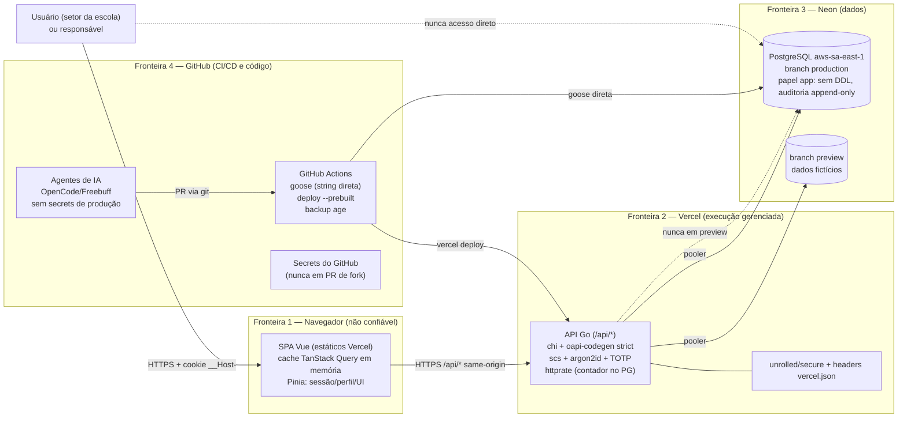

# THREAT-MODEL — Modelagem de Ameaças — ERP Escola Sacre Cœur des Enfants

> **Método:** STRIDE, sobre os fluxos críticos definidos no prompt (login, matrícula, baixa de pagamento, notas, folha de pagamento, acesso da Direção) e sobre as ameaças específicas do processo de desenvolvimento por IA. **Versão:** 1.0 — Etapa 1. **Data:** 16/09/2026.
> **Relacionados:** SRS §5 (RS-XXX), PRD §4 (US-XXX). Cada ameaça gera um requisito rastreável (ID do requisito na tabela).

---

## 1. Escopo e ativos

| # | Ativo | Por que importa |
| :--- | :--- | :--- |
| A1 | Dados pessoais de **alunos menores de idade** (nome, CPF, data de nascimento, documentos) | LGPD art. 14; dano irreversível em caso de vazamento |
| A2 | Dados pessoais de **responsáveis** (nome, CPF/CNPJ, contato) | LGPD; base para fraude |
| A3 | Dados **acadêmicos** (notas, frequência, boletins, histórico) | Integridade: uma nota alterada afeta a vida escolar do aluno |
| A4 | Dados **financeiros** (mensalidades, baixas, contas a pagar, folha) | Integridade: baixa fraudulenta = prejuízo direto |
| A5 | Dados de **funcionários** (pessoais e remuneração) | LGPD; sigilo trabalhista |
| A6 | **Credenciais e segredos** (senhas, segredos TOTP, `DATABASE_URL`, chave `secretbox`, token de deploy, chave age) | Comprometimento = comprometimento de tudo |
| A7 | **Integridade da auditoria** | Sem auditoria confiável, não há repúdio nem investigação |
| A8 | **Integridade da cadeia de suprimentos** (dependências, Actions, modelos de IA) | Código malicioso injetado via dependência ou via prompt |

## 2. Diagrama de fluxo de dados (DFD) com fronteiras de confiança

**Fronteiras de confiança e regras de travessia:**

1. **Navegador → API:** nunca confiável. Toda entrada validada pelo contrato (RS-030); toda rota autenticada/autorizada no backend (RS-020/021); CSRF nas mutações (RS-040); cookie `__Host-` (RS-003).
2. **Vercel → Neon:** credencial de aplicação com privilégio mínimo (RS-024); produção e preview em branches separadas (RS-063).
3. **GitHub → Neon:** apenas dois caminhos — migrações (papel de migração, string direta) e backup (leitura); secrets só em workflows da `main` sem fork (RS-062).
4. **Agentes de IA → GitHub:** sem secrets de produção; conteúdo externo tratado como dados (RS-067/068).
5. **Navegador → dados:** nada sensível persiste no navegador (RE-12); cache da API só em memória, limpo no logout (RF-008).

## 3. Tabela STRIDE por fluxo crítico

Legenda de probabilidade/impacto: B=Muito baixo, Bx=Baixo, M=Médio, A=Alto. Impacto considera ativos A1–A8.

### 3.1 Fluxo: Login (senha + TOTP)

| ID | Ameaça (S/T/R/I/D/E) | Impacto | Prob. | Mitigação | Requisito |
| :--- | :--- | :--- | :--- | :--- | :--- |
| AM-001 | **Spoofing:** roubo de senha (phishing, reuso de senha vazada); sequestro de cookie de sessão (XSS, rede) | A | M | argon2id; cookie `__Host-` HttpOnly/Secure/Strict (bloqueia leitura por JS e envio cross-site); CSP `script-src 'self'`; sessão com inatividade/absoluto; renovação de ID no login | RS-001, RS-003, RS-005, RS-042 |
| AM-002 | **Spoofing/E:** quebra do 2FA (força bruta de TOTP, replay) | A | Bx | TOTP com tentativa única por janela (código descartado após uso); rate limit + bloqueio progressivo por conta; auditoria de falhas | RS-009, RS-012, RS-050/051, RS-010 |
| AM-014 | **DoS:** avalanche de logins para esgotar banco/CU do Neon (custo/indisponibilidade) | M | M | Rate limit por IP e por conta com contador no PG; limites do plano sem cobrança (Hobby não cobra extra); health checks para diagnóstico | RS-050, RS-052 |
| AM-015 | **Repúdio:** usuário nega ter tentado/fallado login | M | Bx | Auditoria append-only de login e falhas (quem, quando, resultado genérico) | RS-010, RS-011 |

### 3.2 Fluxo: Matrícula (gera contrato + mensalidades)

| ID | Ameaça | Impacto | Prob. | Mitigação | Requisito |
| :--- | :--- | :--- | :--- | :--- | :--- |
| AM-004 | **Tampering:** matrícula duplicada, mensalidades geradas duas vezes, valores alterados em trânsito | A | M | Constraint única (RN-002/003); geração de contrato+mensalidades numa única transação; TLS; validação de contrato no backend; auditoria da matrícula | RN-001/002/003, RS-030, RS-010 |
| AM-016 | **EoP:** Secretaria tenta efetivar matrícula sem scope / responsável tenta criar matrícula via API direta | M | M | Autorização no backend por scope (negar por padrão); tentativa negada auditada | RS-020, RS-021, RS-025 |
| AM-017 | **I:** enumeração de alunos por resposta diferenciada (existe/não existe) | M | M | Respostas 404 uniformes para inexistente e sem-permissão; paginação exigida; auditoria de acesso negado | RS-044, RS-025 |

### 3.3 Fluxo: Baixa de pagamento

| ID | Ameaça | Impacto | Prob. | Mitigação | Requisito |
| :--- | :--- | :--- | :--- | :--- | :--- |
| AM-006 | **Tampering/Repúdio:** baixa fraudulenta sem pagamento; alteração/omissão de quem deu a baixa | A | M | Só Financeiro com scope próprio; baixa imutável (RN-010); auditoria append-only com autor; TOTP obrigatório no perfil Financeiro | RS-020, RS-010, RS-011, RS-009 |
| AM-018 | **Tampering:** CSRF que induza o navegador do Financeiro a dar baixa | A | Bx | `http.CrossOriginProtection` nas mutações + `SameSite=Strict` | RS-040, RS-003 |
| AM-019 | **I:** exposição de dados financeiros do aluno a perfil sem permissão (ex.: Coordenação) | M | M | Matriz de permissões (seção 9 do SRS); scope `academico:situacao-financeira:ler` restrito; testes de autorização por perfil | RS-020, RS-022, RS-023 |
| AM-020 | **DoS:** spam de baixas/ajustes para poluir auditoria | Bx | Bx | Rate limit geral; regra RN-010 (sem UPDATE); validação de estado (título pendente) | RS-050, RS-030 |

### 3.4 Fluxo: Notas e frequência

| ID | Ameaça | Impacto | Prob. | Mitigação | Requisito |
| :--- | :--- | :--- | :--- | :--- | :--- |
| AM-005 | **Tampering:** professor altera nota própria ou de outra turma; coordenador altera sem registro | A | M | Escopo `notas:escrever` só para turmas onde leciona (RN-005); alteração com permissão separada (`notas:alterar`, só Coordenação) e auditoria com valor anterior; TOTP obrigatório para RH/Direção (notas de professores) — professor não é perfil TOTP obrigatório, mas alterações ficam auditadas | RS-020, RS-023, RS-010, RF-206 |
| AM-021 | **Repúdio:** professor nega lançamento | M | Bx | Auditoria append-only com autor e valor | RS-010, RS-011 |
| AM-022 | **I:** boletim do filho acessado por responsável errado (IDOR) | A | M | Verificação de posse responsável↔aluno no backend em toda leitura do portal; negativa auditada | RS-023, RS-025, RF-704 |

### 3.5 Fluxo: Folha de pagamento

| ID | Ameaça | Impacto | Prob. | Mitigação | Requisito |
| :--- | :--- | :--- | :--- | :--- | :--- |
| AM-009 | **Tampering/I:** alteração de remuneração; folha enviada duas vezes; vazamento de salários | A | Bx | Escopo `rh:folha:escrever` (só RH); RN-012 (um envio por competência, cancelamento auditado); remuneração individual nunca no Gerencial (RP-004); TOTP obrigatório para RH | RS-020, RS-009, RP-004 |
| AM-023 | **EoP:** usuário RH tenta autoatribuir perfil Financeiro/Direção | A | Bx | Mudança de permissão só por `admin:usuarios:gerenciar`; auditoria de toda mudança; TOTP obrigatório de Admin | RS-020, RS-010 |

### 3.6 Fluxo: Acesso da Direção (painéis e exportação)

| ID | Ameaça | Impacto | Prob. | Mitigação | Requisito |
| :--- | :--- | :--- | :--- | :--- | :--- |
| AM-006b | **I:** exportação de relatório com dados pessoais vaza (PDF baixado, reencaminhado) | A | M | Painéis só agregados (RF-606); exportação auditada (RN-011); TOTP obrigatório Direção; minimização nos relatórios | RF-606, RN-011, RS-009, RS-010 |
| AM-024 | **Spoofing:** sessão da Direção sequestrada em computador compartilhado | A | M | Timeout de inatividade 30 min; cookie `__Host-`; logout claro; TOTP no login | RS-003, RS-001 |

## 4. Ameaças específicas do processo e da plataforma

| ID | Ameaça | Impacto | Prob. | Mitigação | Requisito |
| :--- | :--- | :--- | :--- | :--- | :--- |
| AM-010 | **Código malicioso ou inseguro gerado pelo modelo** (backdoor, credencial hardcoded, SQL concatenado) | A | M | Código tratado como não confiável até passar: gates de CI (gosec, CodeQL, govulncheck, testes de autorização); revisão humana por PR; nenhum PR revisado pelo mesmo modelo que escreveu; proibição de criptografia própria | RS-065, RS-031, RS-004 |
| AM-025 | **Slopsquatting:** modelo inventa pacote; atacante publica o nome | A | M | Dependências só da stack aprovada (Diretiva 2); dependência nova exige ADR + aprovação humana; lockfiles e versões fixadas; OSV-Scanner; Gitleaks | RE-01, RS-061 |
| AM-026 | **Vazamento de segredos em prompts:** IA recebe `DATABASE_URL` ou token e grava no código/log/artifact | A | Bx | Agentes não têm acesso a secrets de produção (RS-067); segredos só na Vercel/GitHub secrets (RS-060); Gitleaks + push protection como gate; RS-066 proíbe segredo em log | RS-060, RS-066, RS-067 |
| AM-027 | **Prompt injection** via issue, comentário de PR, README de dependência ou página web | A | M | Agentes tratam conteúdo externo como dados; só `AGENTS.md`, `ROADMAP.md` e prompt da tarefa definem comportamento; agentes sem secrets; revisão humana confirma | RS-067, RS-068 |
| AM-028 | **PR malicioso de fork** (repo público) tentando executar código com secrets ou disparar deploy | A | Bx | Workflows sem `pull_request_target`; secrets não expostos a forks; proteção contra deploy de forks ligada na Vercel; zizmor no CI; revisão humana obrigatória | RS-062, RE-10 |
| AM-029 | **Preview acessando dados de produção:** `DATABASE_URL` de produção no ambiente Preview | A | Bx | Segregação por ambiente (RS-063): produção só em Production e nos secrets do deploy; previews usam branch `preview` do Neon com dados fictícios; testes de configuração | RS-063, RP-008 |
| AM-030 | **Token de deploy da Vercel vazado** (log, PR, artifact) | A | Bx | Token só em secrets do GitHub, workflow da `main` fixado por hash; Gitleaks; rotação documentada; escopo mínimo do token `[VERIFICAR]` escopos do token da Vercel | RS-060, RS-066 |
| AM-011 | **Perda do autenticador TOTP por administrador** (trava de acesso total) | A | Bx | Procedimento RS-008: outro administrador revalida identidade e reinicia o TOTP; se único admin: procedimento de quebra de vidro documentado (contato com o responsável pelo projeto + execução do comando administrativo de reinício com senha temporária de secret) `[VERIFICAR]` viabilidade do comando de reinício via Actions | RS-008, RF-007 |
| AM-031 | **Exclusão/perda de dados no Neon Free** (projeto inativo 90 dias, limite de armazenamento) | M | M | Backup semanal pg_dump criptografado com age; job mantém o projeto ativo; restauração testada em ambiente isolado | RS-064, RP-010 |
| AM-032 | **Dependência comprometida** (supply chain) atualizada automaticamente | A | Bx | Dependabot com PRs revisados; versões fixadas; OSV-Scanner; Actions fixadas por hash de commit | RS-061, RS-062 |
| AM-033 | **Auditoria adulterada** por usuário com acesso ao banco de aplicação | A | Bx | Papel de aplicação sem UPDATE/DELETE na auditoria (RS-011); só o papel de migração (Actions) gerencia esquema; testes verificam as negações | RS-011, RS-024 |
| AM-034 | **Dado real de criança inserido** em seed/demo/prompt por engano | Crítico | Bx | Regra RP-008 (só dados fictícios) no `AGENTS.md`; revisão humana; Gitleaks auxilia na detecção de CPFs | RP-008 |

## 5. Respostas a incidentes (procedimentos)

| Cenário | Procedimento |
| :--- | :--- |
| **Vazamento de dado pessoal (se dado real — não previsto; RP-009)** | 1. Contenção: revogar sessões, rotacionar segredos, bloquear acesso. 2. Avaliar escopo (quem, quais dados, quanto tempo). 3. Comunicar o responsável pelo projeto e a escola. 4. Seguir art. 48 LGPD: comunicar ANPD e titulares em prazo razoável. 5. Registrar causa raiz e correção em ADR de incidente |
| **Segredo commitado por engano** | 1. Revogar/rotacionar imediatamente (Vercel, GitHub, Neon, chave age se aplicável). 2. Remover do histórico (reescrita coordenada; considerar o segredo comprometido independentemente). 3. Investigar clones/forks. 4. Registrar em auditoria do projeto |
| **Conta administrativa comprometida** | 1. Encerrar todas as sessões (RS-006). 2. Redefinir senha por outro admin (RS-007) e reiniciar TOTP (RS-008). 3. Revisar auditoria de mudanças de permissão e exportações. 4. Revisar regras de firewall/rate limit |
| **Indisponibilidade do Neon/Vercel** | 1. Confirmar via `/api/saude` e `/api/saude/pronto`. 2. Verificar painéis de status e cotas. 3. Se cota esgotada: modo degradado documentado (somente leitura se possível) e comunicação aos usuários. 4. Restaurar backup apenas se perda de dados (RP-010) |
| **PR com código inseguro detectado após merge** | 1. Reverter o merge (rollback instantâneo da Vercel). 2. Abrir issue de incidente com análise. 3. Corrigir com novo PR revisado por modelo diferente. 4. Adicionar caso de teste que reproduza a falha |

## 6. Pendências de verificação `[VERIFICAR]`

1. Escopos disponíveis no token da Vercel para deploy via Actions (privilégio mínimo do token).
2. Viabilidade do comando administrativo de reinício de TOTP do único admin via GitHub Actions (AM-011) — detalhar na Etapa 3/4.
3. Limites de plataforma citados nas mitigação (Vercel Hobby, Neon Free, Actions) — lista unificada no PRD §10.
