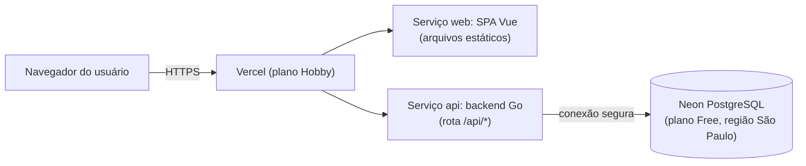

# TUTORIAL — ERP Escola Sacre Cœur des Enfants com custo zero e IA open source

> **Tutorial para estudantes iniciantes.** Este material acompanha o projeto e cresce a cada etapa. Nesta entrega (Etapa 1), os capítulos 1 a 4. O leitor **não precisa escolher tecnologias**: a stack já foi definida e este tutorial explica o papel de cada peça em linguagem simples.

---

## Capítulo 1 — A ideia e o problema

### 1.1 O que estava acontecendo na escola

A Escola Sacre Cœur des Enfants cresceu, mas o jeito de guardar as informações não acompanhou. Cada setor virou uma "ilha":

- A **secretaria** anota matrículas numa planilha.
- O **financeiro** usa um sistema que só ele vê.
- A **coordenação** controla notas num lugar próprio.
- As **compras** e o **almoxarifado** têm controles separados.

O resultado? O mesmo aluno é digitado três vezes, e quando o responsável paga a mensalidade, a secretaria continua vendo "pendente" — porque ninguém avisou. A causa raiz é simples: **não existe um banco de dados compartilhado**. Isso tem nome na disciplina: é o cenário "sem ERP".

### 1.2 O que é um ERP

**ERP** (*Enterprise Resource Planning*, ou planejamento de recursos da empresa) é um sistema único que reúne as várias áreas de uma organização **em cima do mesmo banco de dados**. Quando o financeiro confirma um pagamento, essa informação mora num lugar só — e a secretaria, a direção e qualquer outro setor autorizado veem a mesma versão, na hora. Sem "avisar", sem redigitar, sem planilha paralela.

A lógica de funcionamento é o ciclo **Entrada → Processo → Saída**:

1. **Entrada:** cada setor lança seus dados (matrícula, pagamento, pedido de material).
2. **Processo:** o ERP processa tudo na mesma base, aplicando regras (ex.: a matrícula gera as mensalidades).
3. **Saída:** a informação atualizada aparece para quem precisa — inclusive a direção, que decide com base nela.

### 1.3 O que este projeto quer provar

Duas teses ambiciosas para um trabalho de 1º período:

1. **Custo zero:** dá para construir um ERP do zero até o deploy usando só ferramentas, modelos de IA e hospedagem **gratuitas e/ou open source** — sem cartão de crédito, sem trial que acaba.
2. **Zero código escrito por humanos:** a IA conduz o fluxo inteiro de criação do software. O humano **especifica** (diz o que quer), **revisa** (confere o que a IA fez) e **aprova** (autoriza a publicação). Quem escreve o código são modelos open source rodando em agentes de programação.

> **Termo novo?** *Open source* (código aberto) = software cujo código é público e pode ser usado, estudado e modificado livremente. *Deploy* = colocar o sistema no ar, acessível pelos usuários. *IA open source* = modelos de linguagem cujos pesos são públicos, como os disponíveis em ferramentas de agentes gratuitas.

### 1.4 O papel de quem conduz (você)

Como ninguém escreve código à mão, seu trabalho é:

- **Especificar:** descrever o que o sistema deve fazer, com clareza (é o que os documentos PRD, SRS e THREAT-MODEL fazem).
- **Revisar:** ler os PRs que a IA abre, conferir se batem com a especificação e testar o preview.
- **Aprovar:** autorizar o merge (juntar o trabalho na branch principal) só quando estiver certo e seguro.

E, muito importante: **julgar o trabalho da IA**. Ela erra. As verificações automáticas (capítulo 4) existem para que o erro dela seja encontrado por uma máquina, não por um aluno frustrado.

## Capítulo 2 — Como o sistema funciona por dentro

### 2.1 A arquitetura em uma frase

> O navegador carrega uma aplicação Vue hospedada na Vercel; a mesma Vercel roda o backend em Go no endereço `/api`; e esse backend fala com um banco PostgreSQL hospedado no Neon. Tudo gratuito, tudo na região São Paulo.



### 2.2 O que é serverless (e por que escolhemos)

**Serverless** não é "sem servidor" — é "servidor de outra pessoa, que você não gerencia". Sua função de backend fica "dormindo"; quando chega uma requisição, a plataforma acorda, executa seu código e cobra (ou, no plano gratuito, **conta**) apenas o tempo em que o código rodou.

- **Vantagem para este projeto:** no plano Hobby da Vercel não é possível comprar uso extra — se algo der errado, o sistema para, mas **nada é cobrado**.
- **A consequência (cold start):** a primeira requisição depois de um tempo sem uso demora mais — a função e o banco podem precisar "acordar". Nosso sistema trata isso: a interface mostra carregamento e o cache de dados tenta de novo automaticamente (meta: até 5 s na primeira requisição).

### 2.3 Por que frontend e backend no mesmo domínio

O domínio é o endereço (`algo.vercel.app`). Aqui, a SPA (frontend) e a API (backend) moram **no mesmo domínio**. Isso traz três presentes:

1. **Cookie first-party:** o identificador da sessão é um cookie criado pelo próprio site que você acessa — o navegador o trata como confiável e ele pode ter as proteções mais fortes (`__Host-`, `SameSite=Strict`).
2. **Sem CORS:** CORS é a burocracia de segurança que existe quando o frontend fala com um backend de outro domínio. No mesmo domínio, ela simplesmente não existe.
3. **Sobe e volta junto:** frontend e backend são deployados juntos; nunca há uma versão nova do frontend falando com uma versão velha do backend.

### 2.4 Por que produção e preview têm bancos separados

Quando a IA abre um PR (pull request — proposta de alteração), a Vercel cria um **preview**: uma versão temporária do site só para avaliar a alteração. Esse preview usa uma **branch separada do banco** no Neon, com **dados fictícios**.

Por quê? Três razões:

1. **Segurança:** ninguém sabe ainda se aquele código é bom. Ele não pode tocar no banco de verdade.
2. **Liberdade para testar:** dá para clicar, deletar, estragar — o banco de produção fica intacto.
3. **LGPD:** dados pessoais reais (de verdade, os da escola) nunca existem neste projeto — mas a separação garante que, num uso real, o teste nunca suje o dado real.

### 2.5 O papel de cada peça da stack (em linguagem simples)

> A stack foi **definida pelo autor do projeto**. Você não escolhe — você entende. Detalhes técnicos nas ADRs (`../adr/0001` a `../adr/0004`).

**Backend (o "cérebro" que valida e decide):**

| Peça | Papel simples |
| :--- | :--- |
| **Go** | Linguagem compilada, rápida e rígida: ela avisa quando algo está errado antes de rodar — ótimo para IA que erra |
| **chi** | Biblioteca que organiza as URLs do backend (`/api/alunos`, `/api/titulos`…) |
| **OpenAPI + oapi-codegen** | O contrato da API é escrito primeiro (um "acordo" do que cada endpoint aceita e devolve), e o código do servidor que cumpre o acordo é **gerado automaticamente** |
| **sqlc + pgx** | As consultas SQL são escritas à mão, e o código Go que executa essas consultas é **gerado automaticamente** — sempre com parâmetros seguros (nada de "colar" texto do usuário no SQL) |
| **goose** | Ferramenta de migrações: arquivos versionados que criam/alteram as tabelas do banco de forma controlada |
| **scs** | Guarda as sessões (quem está logado) no PostgreSQL |
| **argon2id** | Transforma a senha num "hash" ilegível e seguro — nunca guardamos a senha de verdade |
| **pquerna/otp** | Gera e valida o código do segundo fator (TOTP, o tal "autenticador" de 6 dígitos) |
| **maroto** | Gera PDFs (boletim, boleto, relatórios) na hora da requisição |

**Frontend (a "cara" que o usuário vê):**

| Peça | Papel simples |
| :--- | :--- |
| **Vue 3 + TypeScript** | Framework que monta as telas; TypeScript avisa erros de tipo antes de rodar |
| **Vite** | Ferramenta de build: transforma o código-fonte em arquivos otimizados para o navegador |
| **Vue Router** | Controla as "páginas" da SPA e bloqueia rotas que o seu perfil não pode ver (a segurança de verdade fica no backend) |
| **Pinia** | Guarda só o essencial: sessão, perfil, tema |
| **TanStack Query** | Busca e guarda os dados da API **em memória**, com atualização automática — e limpa tudo no logout |
| **Orval + Zod** | Gera automaticamente o cliente HTTP e as validações de formulário a partir do mesmo contrato OpenAPI |
| **PrimeVue + Tailwind** | Componentes prontos (tabelas, formulários, gráficos) com tema claro/escuro e estilos utilitários |

**Qualidade e segurança (as "provas" de que o código está bom):** capítulo 4.

### 2.6 Fluxograma da escola → módulos do sistema

O fluxograma da atividade vira a organização do sistema: **setores** usam **módulos** que compartilham o **banco único**. As setas vermelhas do desenho — as informações que hoje dependem de alguém avisar — viram código: a matrícula gera mensalidades automaticamente (FX-01) e a baixa do pagamento atualiza a situação do aluno na hora (FX-02). O módulo Gerencial lê a base e entrega os indicadores à Direção.

## Capítulo 3 — Requisitos: dizer exatamente o que queremos

### 3.1 O que é um "requisito" (e por que numerar tudo)

**Requisito** é uma afirmação verificável sobre o que o sistema faz. "O sistema deve ser bom" não é requisito — "o p95 das leituras da API é ≤ 500 ms" é. Como a IA vai implementar, cada exigência precisa ter:

- um **ID único** (RF-101, RS-020…), para que a tarefa do roadmap diga "esta tarefa atende RF-104 e RS-010" e você possa conferir;
- um **critério de aceite** em Given/When/Then (Dado que…, Quando…, Então…), que descreve o teste que prova a exigência.

### 3.2 O dicionário de IDs

| Prefixo | Significado | Exemplo |
| :--- | :--- | :--- |
| **RF-** | Requisito Funcional: o que o sistema faz | RF-104: efetivar matrícula gera contrato e mensalidades |
| **RNF-** | Requisito Não Funcional: quão bem faz | RNF-001: leituras da API com p95 ≤ 500 ms |
| **RS-** | Requisito de Segurança | RS-020: todo endpoint exige autenticação e autorização |
| **RP-** | Requisito de Privacidade (LGPD) | RP-008: somente dados fictícios |
| **RN-** | Regra de Negócio | RN-001: a matrícula gera o contrato e as mensalidades |
| **US-** | História de Usuário (o usuário conta o que precisa) | US-102: "Como secretaria, quero efetivar a matrícula…" |
| **AM-** | Ameaça (modelagem STRIDE) | AM-006: baixa fraudulenta de pagamento |

### 3.3 Segurança com dados de criança: por que tanto rigor

Este sistema, num uso real, guardaria **dados de menores de idade** — nome, CPF, data de nascimento, notas, situação financeira. A **LGPD** (Lei Geral de Proteção de Dados) tem um artigo inteiro para isso (o art. 14): dados de crianças e adolescentes merecem proteção reforçada e o "melhor interesse" da criança como guia.

Conceitos que vão aparecer o tempo todo e por que importam aqui:

- **Autenticação × autorização.** Autenticação é provar quem você é (senha + segundo fator). Autorização é definir o que você pode fazer (perfis e permissões). Um professor autenticado **não** pode alterar nota da turma do outro — isso é autorização.
- **Privilégio mínimo:** cada pessoa só tem a permissão estritamente necessária. Quem lança nota não vê folha de pagamento.
- **Negar por padrão:** se nada disse que você pode, você não pode. É mais seguro que "permitir e ir recortando".
- **Auditoria:** registro imutável de quem fez o quê e quando. Num sistema com notas e pagamentos, é o que permite investigar "quem alterou essa nota?".
- **Segundo fator (2FA/TOTP):** além da senha, um código do celular do usuário. Se a senha vazar, o ladrão ainda precisa do código. Obrigatório para quem mexe com dinheiro, folha e administração.
- **Auditoria append-only:** a tabela de auditoria só aceita inserção — nem quem acessa o banco por dentro apaga o rastro.

Neste projeto acadêmico, **só existem dados fictícios** — nomes e CPFs inventados. Mas o sistema é desenhado como se fosse real, porque essa é a lição: segurança se desenha desde o início, não se cola no fim.

### 3.4 Como ler os documentos desta etapa

| Documento | O que tem | Quando usar |
| :--- | :--- | :--- |
| `PRD.md` | O **porquê**: problema, personas, escopo, histórias de usuário, prioridades, riscos, viabilidade | Para decidir o que entra no MVP |
| `SRS.md` | O **o quê**: requisitos numerados, perfis, regras de negócio, modelo de dados, API | Para conferir se uma tarefa cumpre o que foi pedido |
| `THREAT-MODEL.md` | O **e se der errado**: ameaças STRIDE e mitigação | Para entender por que tanta regra de segurança |
| `../adr/*.md` | O **por que assim**: decisões de arquitetura registradas | Para entender (ou contestar) uma escolha da stack |

## Capítulo 4 — As verificações automáticas (o "tribunal" do código)

Como a IA escreve o código, quem confere é a máquina. Cada verificação abaixo é um **gate** (portão): se falhar, o PR não pode ser mesclado.

### 4.1 A lista e o que significa cada uma

| Verificação | O que faz | Quando falha, significa que… |
| :--- | :--- | :--- |
| **Compilação (Go)** | Traduz o código para o binário | Há erro de sintaxe ou tipo no backend |
| **Type check (vue-tsc)** | Confere os tipos no frontend | Uma variável prometeu ser de um tipo e entregou outro |
| **Lint (golangci-lint / ESLint + Prettier)** | Confere estilo e pegadinhas conhecidas | O código pode funcionar, mas tem maus hábitos ou riscos (incluindo gosec, que procura padrões inseguros) |
| **Testes (Go testing + Vitest)** | Executa pequenos programas que provam comportamentos | Um comportamento prometido deixou de valer |
| **Testcontainers (Go)** | Sobe um PostgreSQL de verdade para os testes | A consulta SQL ou a regra que depende do banco falhou num banco real |
| **Testes E2E (Playwright)** | Abre o navegador e usa o sistema como um usuário | O fluxo da tela quebrou de ponta a ponta |
| **Acessibilidade (@axe-core)** | Varre as telas atrás de violações WCAG | Algo exclui usuário com deficiência (ex.: botão sem rótulo) |
| **Lighthouse CI** | Mede performance das páginas | A página ficou lenta ou o bundle cresceu demais |
| **CodeQL** | Análise estática de segurança (Go e TypeScript) | Padrão perigoso (ex.: consulta não parametrizada, XSS) |
| **govulncheck / OSV-Scanner** | Procuram vulnerabilidades conhecidas no código e nas dependências | Uma biblioteca usada tem falha conhecida |
| **Gitleaks** | Procura segredos (senhas, tokens) no código | Alguém colou uma credencial — blocker imediato |
| **zizmor** | Audita os workflows do GitHub Actions | Um workflow permite vazamento de secrets (ex.: `pull_request_target` com fork) |
| **Redocly** | Valida o contrato OpenAPI | A API quebrou o acordo documentado |
| **ZAP (DAST)** | Ataca a aplicação rodando (agendado) | Uma falha só visível em execução |

### 4.2 O que fazer quando um gate falha

1. **Leia o erro até a linha citada.** A maioria aponta arquivo e linha.
2. **Reproduza localmente** com o comando do Taskfile (ex.: verificação completa antes de PR). O CI confirma; não descobre.
3. **Peça para a IA corrigir apontando o erro exato** — não "arruma aí" genérico. Ela roda, vê o output, corrige, roda de novo.
4. **Se o erro indicar problema de projeto** (dependência inventada, requisito mal escrito), pare e corrija a causa raiz — não o sintoma.
5. **Nunca desative um gate para "passar"**. Desativar é decisão de projeto, com ADR.

### 4.3 Por que gates importam mais quando quem escreve é IA

Um desenvolvedor humano experiente carrega intuição; o modelo de IA carrega padrão e probabilidade. Quando o padrão é bom, o resultado é rápido e consistente; quando o padrão falha, o erro é sistemático. Os gates transformam "confio que está certo" em "**a máquina provou que está certo**" — e é essa prova que permite a um estudante de 1º período revisar o trabalho de uma IA sem ser especialista em cada linguagem.

> **Próximos capítulos** (etapa seguinte): capítulo 9 — o roadmap de tarefas e como executá-las com os agentes (Etapa 4). Ver `ROADMAP.md` e o capítulo 9 abaixo.

## Capítulo 5 — As contas gratuitas e o painel de consumo

O projeto só existe se nada custar dinheiro. Antes de qualquer código, você (o humano!) cria as contas. Nenhuma delas pede cartão de crédito — se alguma pedir, **pare**: o plano mudou e isso é um bloqueio (Diretiva 3).

### 5.1 GitHub (onde o código e o CI vivem)

1. Crie uma conta gratuita em `github.com/signup`. Use um e-mail que você acesse.
2. Ative **Two-factor authentication** nas configurações (a conta que guarda o projeto de uma escola também precisa de 2FA!).
3. Crie o repositório do projeto: em `github.com/new`, escolha a **sua conta pessoal** (não uma organização — o plano Hobby da Vercel não conecta repos de organização), marque **Public** e **não** adicione README, `.gitignore` ou licença (o conteúdo já existe localmente). Depois conecte e publique a `main` (pré-requisito da tarefa F-01 do roadmap):
   ```bash
   git remote add origin https://github.com/<sua-conta>/erp-escola-opensource.git
   git push -u origin main
   ```
4. No repositório do projeto, ative **Secret scanning** e **Push protection** em *Settings → Code security* — é o que impede alguém (ou uma IA) de publicar um segredo por acidente. Em repositórios públicos esses recursos são habilitados por padrão `[VERIFICAR]`.

### 5.2 Vercel (onde o sistema roda)

1. Crie a conta em `vercel.com/signup` usando **Continue with GitHub** — assim a Vercel vê seus repositórios sem senha.
2. O plano **Hobby** é o gratuito permanente. Ele não permite comprar uso extra — ou seja, é impossível ser cobrado por acidente. É por isso que ele foi escolhido.
3. Importe o repositório e confirme, nas configurações do projeto, que a **região das funções** pode ser fixada em São Paulo (`gru1`) `[VERIFICAR]` — é isso que mantém a latência baixa e os dados no Brasil (LGPD).
4. **Acompanhando o consumo:** na aba *Usage* do projeto aparecem invocações, tempo de CPU ativa e largura de banda. O tutorial da Etapa 4 mostra como olhar isso semanalmente.

### 5.3 Neon (o banco de dados)

1. Crie a conta em `neon.tech` com GitHub. O plano **Free** é permanente e não pede cartão.
2. Crie o projeto e confirme que a região **`aws-sa-east-1`** (São Paulo) está disponível `[VERIFICAR]`.
3. Crie as **branches** do banco: `main` (produção) e `preview` (dados fictícios). Pense em branches do Git, mas para o banco: a preview pode ser apagada e recriada sem afetar a produção.
4. **Acompanhando o consumo:** o painel mostra **CU-horas** (a "potência×tempo" que o banco consumiu) e armazenamento. O plano Free dorme o banco após inatividade — por isso o backup semanal existe também para "acordar" o projeto e evitar a exclusão de projetos inativos.

### 5.4 O agente de IA (quem escreve o código)

1. Instale o **OpenCode** (agente open source que lê o `AGENTS.md` da raiz do repositório) e conecte-o ao **OpenCode Zen**, o catálogo de modelos gratuitos `[VERIFICAR]` catálogo atual.
2. Alternativas quando a cota acabar: **Freebuff** e **Kilo Code** — as tarefas são escritas para não dependerem de recursos exclusivos de uma ferramenta.
3. Regra fixa do projeto (guarde-a!): usa-se **um modelo open source gratuito**, preferindo os que não treinam com seus dados; **um modelo mais forte planeja e revisa, um mais rápido executa**; e **nenhum PR é revisado pelo mesmo modelo que o escreveu**.

> **Termo novo:** *cota*. Cada plano gratuito mede consumo de um jeito (invocações, CU-horas, minutos de CI). A seção 7 do PRD calcula o consumo estimado com margem — se o painel mostrar consumo diferente do previsto, é sinal para revisar a estimativa.

## Capítulo 6 — Como a IA trabalha aqui (e como você revisa)

### 6.1 O contrato de comportamento: `AGENTS.md`

Na raiz do repositório vive o `AGENTS.md`, que todo agente lê antes de trabalhar. Ele é curto e duro: proibições (não tocar em código gerado, não usar `localStorage`, não inventar dependência), obrigatoriedades (todo endpoint nasce autenticado, toda ação sensível audita) e o Definition of Done (checklist final). Quando um agente "esquece" uma regra, a culpa é da tarefa ou do `AGENTS.md` — então corrigimos a **fonte da instrução**, não só o PR.

### 6.2 O ciclo de uma tarefa

1. O humano (ou o planejador) escolhe uma tarefa no `ROADMAP.md` e cola o prompt pronto no agente.
2. O agente lê os documentos citados pelos IDs (RS-010, RN-001…), implementa, roda `task verificar` localmente e abre um **Pull Request** (PR — uma proposta de mudança que outra pessoa aprova antes de entrar no código principal).
3. O corpo do PR registra: ID da tarefa, **agente e modelo usados**, requisitos atendidos. Essa é a rastreabilidade da tese nº 2 do projeto: provar que IA escreveu tudo.
4. **Um modelo diferente revisa** o PR como revisor; o humano aprova por último.

### 6.3 Como revisar um PR de IA sem ser especialista

Você não precisa entender cada linha. Verifique, nesta ordem:

1. **O CI está verde?** Se qualquer gate falhou, o PR não entra — o tribunal do capítulo 4 já fez metade da revisão.
2. **O escopo é só da tarefa?** Mudança demais no PR é sinal de problema (o agente "se empolgou"). Pça dividir.
3. **Os IDs batem?** O PR lista os requisitos que atende; confira 2 ou 3 deles no SRS.
4. **Proibições duras:** procure no diff por `localStorage`, `v-html`, senhas em texto, arquivos gerados editados. São as violações mais comuns de modelo.
5. **Teste o preview:** a Vercel cria, para cada PR, um **deployment de preview** — uma versão temporária do site, num endereço próprio, ligada ao banco fictício. Clique no link, faça login com a conta de teste da tarefa e tente quebrar a tela. Preview **nunca** toca o banco de produção (RS-063) — por isso você pode clicar sem medo.
6. Fez sentido do lado do usuário? Os requisitos dizem **o que**; você é o juiz do **como ficou**.

> **Termo novo:** *diff*. A lista de linhas que mudaram. Linhas verdes entram, vermelhas saem. Revisar PR de IA é, na prática, revisar o diff com o checklist acima.

## Capítulo 7 — Medindo performance e responsividade

### 7.1 As três notas do navegador: Core Web Vitals

O Google definiu três medidas que resumem a experiência de quem usa:

| Vital | Pergunta que responde | Meta do projeto (RNF-002) |
| :--- | :--- | :--- |
| **LCP** (Largest Contentful Paint) | "O conteúdo principal apareceu rápido?" | < 2,5 s |
| **INP** (Interaction to Next Paint) | "A página responde quando eu clico?" | < 200 ms |
| **CLS** (Cumulative Layout Shift) | "A página dança enquanto carrega?" | < 0,1 |

### 7.2 Medindo com o DevTools (sem instalar nada)

1. Abra o site (local ou preview) no Chrome e pressione **F12**.
2. Aba **Network**: recarregue com a aba aberta e veja o peso do carregamento inicial (cruze com a meta de bundle do RNF-002) e o tempo da maior requisição.
3. Aba **Performance**: grave (botão de gravação), interaja e procure bloqueios longos.
4. **Responsividade:** no DevTools, o ícone de celular/tablet (*device toolbar*) simula telas estreitas — o SRS exige funcionar a partir de 360 px de largura. Teste as telas principais nos presets de celular pequeno.
5. O **Lighthouse CI** automatiza essa mesma nota a cada merge na `main` — o que você faz à mão acima é a mesma medida que o CI faz sozinho.

### 7.3 Por que a primeira visita pode ser lenta (e está tudo bem)

No plano gratuito, a função e o banco **adormecem** quando ninguém usa (*cold start* — capítulo 2). A primeira requisição após um tempo parado pode levar até RNF-003 segundos. O design já compensa: skeletons na tela (§13.3), retentativas automáticas (§23.4) e um health check que não toca o banco. Se uma tela parecer lenta, primeiro confira: era a primeira visita após inatividade? Aí é comportamento esperado; se for sempre lenta, é bug de performance — registre com o número do vital no título.

## Capítulo 8 — Lições aprendidas até aqui (seção viva)

- **Especificar é 80% do trabalho.** Os requisitos desta etapa existem para que a IA não tenha de adivinhar. Ambiguidade barata vira bug caro depois.
- **Segurança é arquitetura.** A modelagem de ameaças veio **antes** de qualquer código; cada ameaça virou requisito com ID. É mais fácil construir o cofre no projeto da casa do que reformar depois.
- **Menos código escrito = menos código errado.** A preferência por código gerado (oapi-codegen, sqlc, Orval) não é preguiça: é reduzir a área onde a IA pode errar.
- **Decisão registrada é decisão reutilizável.** As ADRs existem para que, daqui a meses, alguém (ou algum modelo) entenda **por que** a stack é assim — e não reabra discussão encerrada.
- **Contrato primeiro.** Fechar a especificação antes do código (o `openapi.yaml` como fonte única que gera backend e frontend) elimina a maior fonte de erro de IA: a divergência entre o que os lados acham que combinaram.
- **Lint que ensina arquitetura.** As regras de lint do projeto não são sobre estilo: proibir `localStorage`, proibir `v-html` e checar código gerado transformam decisões de segurança em erros automáticos. Se uma regra pode ser verificada por máquina, ela deve ser — o revisor humano pensa no que a máquina não vê.
- **Plano B é especificação, não improvável.** Documentar a migração de contingência (ADR-0005) antes da necessidade custou uma tarde; inventá-la sob pressão custaria dias — e sairia pior.

## Capítulo 9 — O roadmap e como executar com os agentes (Etapa 4)

> Este capítulo entrega a Etapa 4 junto com o `ROADMAP.md`. Leia os dois juntos: aqui está o "como", lá está o "o quê, em que ordem".

### 9.1 O mapa em 30 segundos

O roadmap tem 7 fases e 24 tarefas: **Fase 0 Fundação (F-01…F-10)** → Fase 1 Acadêmico+Financeiro (N-01…N-04) → Fase 2 Pedagógico (P-01…P-03) → Fase 3 Compras/Estoque (C-01…C-03) → Fase 4 RH+Contas a pagar (R-01…R-02) → Fase 5 Gerencial+Portal (G-01…G-03) → Fase 6 Endurecimento (E-01…E-02). **Nenhuma feature começa antes da fundação estar mesclada e verde.**

### 9.2 Anatomia de uma tarefa

Cada tarefa do roadmap tem: ID e título, dependências, requisitos atendidos (IDs), contexto mínimo, bibliotecas, arquivos, passo a passo, cuidados de segurança, critérios de aceite, `task verificar`, passos manuais e **prompt pronto**. O prompt pronto é o texto que você cola no OpenCode (vale no Freebuff/Kilo Code).

### 9.3 Executando uma tarefa (passo a passo)

1. Escolha a próxima tarefa da fase atual (ex.: `F-01`) e copie o **prompt pronto**.
2. Cole no agente com o repo aberto. Ele lê os IDs citados, implementa, roda `task verificar` e abre o PR.
3. Confira o corpo do PR: ID da tarefa, agente+modelo, requisitos, o que mudou, riscos, como testar.
4. Peça a **um modelo diferente** para revisar; você aprova por último (capítulo 6).
5. Se o CI falhar, não desative o gate: leia o erro, peça ao agente para corrigir a causa, rode `task verificar` de novo.

### 9.4 O que é "fundação pronta" (gate)

F-01…F-10 mescladas, `task verificar` verde, login com TOTP funcionando num preview contra o banco fictício, auditoria append-only provada por teste, backup com restore testado e os 15 `[VERIFICAR]` da SRS §31 resolvidos (tarefa F-09) ou com ADR de contingência.

### 9.5 Erros comuns e saídas

| Sintoma | Causa provável | O que fazer |
| :--- | :--- | :--- |
| `gerar:checar` falha | IA editou `internal/httpapi`, `internal/db` ou `src/api` à mão | Reverter edição manual, mudar o `openapi.yaml`/`queries/` e regenerar |
| 401 em tudo no preview | Cookie `__Host-` ou env de Preview errada | Conferir §26: Preview usa `DATABASE_URL_PREVIEW`, nunca a de produção |
| 403 onde deveria passar | Scope faltando no contrato ou perfil sem linha em `usuario_perfil` | Conferir matriz §9 e scopes da §12 |
| Migração trava | Usou string com pooler ou ordem errada | Migração sempre direta + papel migração, antes do deploy (§29) |
| Tarefa grande demais | PR com 3 assuntos | Dividir e registrar no ROADMAP; um PR = uma tarefa |

## Pendências de verificação

Nenhuma nova nesta etapa. As 15 da SRS §31 são resolvidas na tarefa F-09 do ROADMAP.
