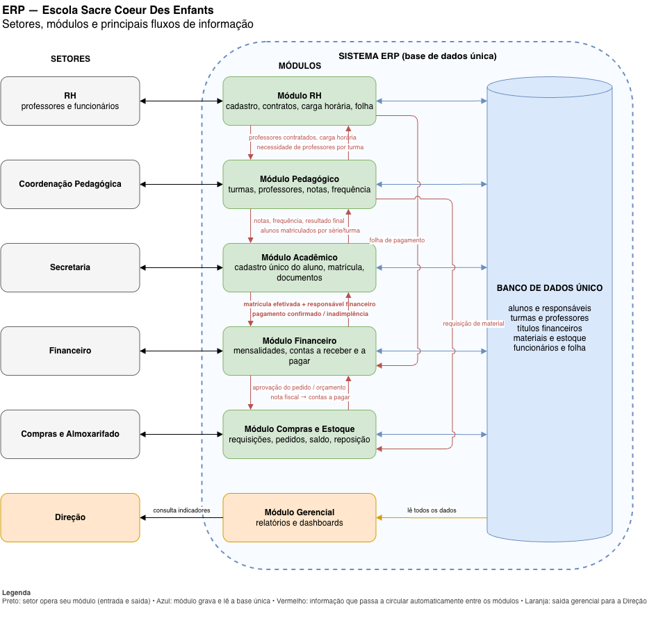

# Atividade — ERP para a Escola Sacre Coeur Des Enfants

> **Disciplina:** Tecnologia e Sistemas — Prof. Rodrigo Aparecido Justino  
> **Curso:** Engenharia de Software — 1º Período Noturno — UNDB  
> **Aluno:** Jader Augusto Maciel Fonseca  
> **Data:** 14/09/2026

---

## 1. Diagnóstico do problema

A escola cresceu, mas a forma de organizar as informações continuou a mesma: cada setor tem o seu próprio controle e nenhum deles conversa com o outro.

| Setor | Como controla hoje |
| :--- | :--- |
| Secretaria | Planilhas com matrículas e dados dos alunos |
| Financeiro | Um sistema só dele, com mensalidades e pagamentos |
| Coordenação | Controle separado das informações acadêmicas |
| Compras e materiais | Controles próprios |
| Professores e funcionários | Controles próprios |

Como o mesmo dado (por exemplo, o cadastro de um aluno) fica guardado em vários lugares diferentes, cada setor acaba com uma versão diferente da mesma informação. Quando algo muda em um setor, os outros só ficam sabendo se alguém avisar. É daí que vêm os problemas citados no caso:

- **Informações duplicadas:** o mesmo aluno é digitado na planilha da secretaria, no sistema do financeiro e no controle da coordenação.
- **Dificuldade de achar o dado atualizado:** com três cadastros do mesmo aluno, ninguém sabe qual está certo.
- **Demora na comunicação:** o responsável paga a mensalidade, mas a secretaria continua vendo o aluno como pendente até alguém do financeiro avisar.
- **Retrabalho:** a mesma matrícula precisa ser digitada de novo no financeiro e na coordenação.
- **Compras sem ver o estoque:** o setor de compras pede material que já existe no almoxarifado, ou deixa faltar, porque não enxerga o saldo real.

**Causa principal:** a escola não tem uma base de dados compartilhada. Cada setor trabalha com um sistema separado, sem integração — é exatamente o cenário "sem ERP" visto em aula: um banco de dados para cada área, informação descentralizada e processos isolados. O crescimento da escola não criou o problema, só deixou ele aparecer, porque ficou informação demais para repassar na mão.

---

## 2. Levantamento de necessidades

### 2.1. Setores que precisam ser integrados

1. **Secretaria** — matrícula, rematrícula, cadastro de alunos e responsáveis, documentos.
2. **Financeiro** — mensalidades, pagamentos, inadimplência, pagamento de fornecedores e da folha.
3. **Coordenação Pedagógica** — turmas, professores por turma, notas, frequência, boletim.
4. **Compras e Almoxarifado** — pedidos de material, fornecedores, controle de estoque.
5. **RH (professores e funcionários)** — cadastro, contratos, carga horária, folha de pagamento.
6. **Direção** — não é um setor operacional, mas precisa receber a informação consolidada de todos os outros para tomar decisões.

### 2.2. Informações que precisam circular entre os setores

| De → Para | Informação | Para quê |
| :--- | :--- | :--- |
| Secretaria → Financeiro | Matrícula efetivada, série e dados do responsável | Gerar o contrato e as mensalidades |
| Financeiro → Secretaria | Pagamento confirmado ou pendente | Secretaria ver a situação real do aluno sem esperar aviso |
| Secretaria → Coordenação | Alunos matriculados por série | Montar as turmas |
| Coordenação → Secretaria | Notas, frequência e resultado final | Emitir boletim, histórico e declarações |
| Coordenação → RH | Quantos professores cada turma precisa | RH alocar ou contratar |
| RH → Coordenação | Professores contratados e carga horária | Distribuir as aulas |
| RH → Financeiro | Folha de pagamento | Financeiro pagar os salários |
| Coordenação / setores → Compras | Pedido de material | Compras saber o que foi pedido |
| Almoxarifado → Compras | Saldo atual do estoque | Comprar só o que falta |
| Compras → Almoxarifado | Material recebido | Atualizar o estoque |
| Compras → Financeiro | Pedido aprovado e nota fiscal | Financeiro pagar o fornecedor |
| Todos → Direção | Indicadores (inadimplência, alunos por turma, gastos, estoque) | Decidir com base em informação |

---

## 3. Definição dos módulos do ERP

Todos os módulos usam o **mesmo banco de dados**. O aluno, o responsável, o professor e o material são cadastrados **uma vez só** e todos os setores usam esse mesmo cadastro.

| Módulo | Setor que usa | Para que serve |
| :--- | :--- | :--- |
| **Acadêmico** | Secretaria | Cadastro único de alunos e responsáveis, matrícula, rematrícula, documentos e histórico escolar |
| **Pedagógico** | Coordenação | Turmas, professores por turma, notas, frequência e boletim |
| **Financeiro** | Financeiro | Mensalidades, boletos, baixa automática dos pagamentos, inadimplência e pagamento de fornecedores e salários |
| **Compras e Estoque** | Compras e Almoxarifado | Pedidos de material, fornecedores, entrada e saída de material, saldo do estoque e aviso de reposição |
| **RH** | RH | Cadastro de professores e funcionários, contratos, carga horária e folha de pagamento |
| **Gerencial** | Direção | Relatórios e painéis com os dados de todos os módulos |

O funcionamento segue o ciclo **Entrada → Processo → Saída** visto em aula: os setores entram com os dados (matrícula, pagamento, pedido de material), o ERP processa tudo na mesma base, e a saída é a informação atualizada para quem precisa dela — inclusive a Direção.

---

## 4. Problemas que o sistema deverá resolver

| Problema | Como o ERP resolve |
| :--- | :--- |
| Aluno cadastrado em vários lugares | Cadastro único; os outros módulos usam o mesmo registro |
| Secretaria demora a saber do pagamento | Quando o Financeiro dá baixa no boleto, a situação do aluno muda na hora e a Secretaria vê no mesmo sistema |
| Compras feitas sem ver o estoque | O pedido de material consulta o saldo real; só gera compra se faltar; o sistema avisa quando o estoque fica baixo |
| Retrabalho de digitação | A matrícula é digitada uma vez e gera automaticamente o contrato, as mensalidades e a vaga na turma |
| Dificuldade de achar o dado atualizado | Existe um único lugar para consultar; todos veem a mesma informação |
| Direção sem visão do todo | Relatórios e painéis reúnem os dados de todos os módulos |

---

## 5. Benefícios esperados

- **Informação única e sempre atualizada** — acaba a dúvida sobre qual planilha está certa.
- **Comunicação automática entre os setores** — o pagamento confirmado no Financeiro aparece na Secretaria sem ninguém precisar avisar.
- **Menos retrabalho e menos erro** — cada dado é digitado uma vez só.
- **Compras mais certas** — a decisão é feita olhando o saldo real do almoxarifado, evitando comprar o que já tem ou deixar faltar.
- **Controle da inadimplência** — a situação financeira do aluno fica visível para quem precisa (Secretaria e Direção).
- **Visão geral para a Direção** — alunos, finanças, pessoal e estoque em um só painel.
- **A escola pode continuar crescendo** — sem precisar criar mais controles paralelos.

---

## 6. Fluxograma do ERP (Draw.io)

**Como ler o fluxograma:**

- **Coluna da esquerda (Setores):** RH, Coordenação Pedagógica, Secretaria, Financeiro, Compras e Almoxarifado e Direção. Cada setor usa o seu módulo (setas pretas de entrada e saída).
- **Centro (Módulos do ERP):** RH, Pedagógico, Acadêmico, Financeiro, Compras e Estoque e Gerencial. As **setas vermelhas** são as informações que hoje dependem de alguém avisar e que, com o ERP, passam a circular sozinhas — em destaque as duas citadas no caso: *matrícula efetivada* (Acadêmico → Financeiro) e *pagamento confirmado* (Financeiro → Acadêmico).
- **Direita (Banco de Dados Único):** todos os módulos gravam e leem a mesma base (setas azuis). Aluno, responsável, professor, título e material existem uma única vez.
- **Módulo Gerencial (laranja):** lê todos os dados da base e entrega os indicadores para a Direção — é a **saída** do sistema para a tomada de decisão.
